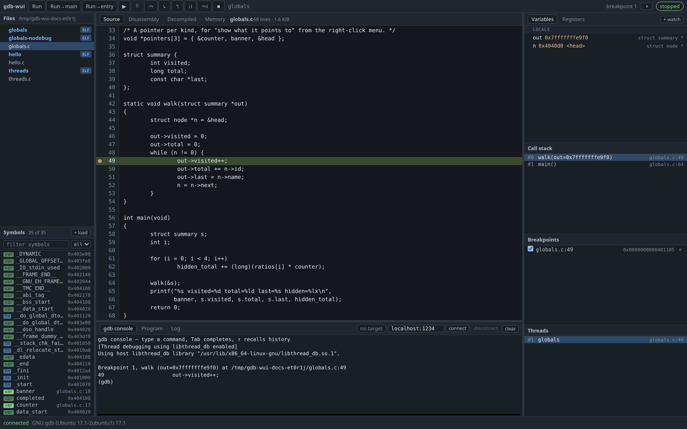

# gdb-wui

gdb-wui is a web UI for GDB. It shows source, disassembly, variables, registers,
memory, threads and a gdb console in a browser tab, while GDB itself does the
debugging.

**📖 [Documentation, with screenshots](https://retrocpugeek.github.io/gdb-wui/)**

```sh
go build ./cmd/gdb-wui
./gdb-wui -project /path/to/your/repo
```

gdb-wui prints a URL and opens a browser at it. To start debugging, pick an
executable from the file tree, click a line number to set a breakpoint, and
step.

Arguments you use every time can go in a `gdb-wui.json` in the working
directory or in `~/.config/gdb-wui/`; see
[the config file page](https://retrocpugeek.github.io/gdb-wui/reference/config.html).

[](https://retrocpugeek.github.io/gdb-wui/)

> ## ⚠ gdb-wui runs your programs with your privileges
>
> That is what a debugger does; sandboxing the program being debugged is not a
> goal.
>
> gdb-wui listens on loopback only, and refuses a non-loopback address unless
> you pass `-listen-anywhere`. Do not expose it to a network you do not control:
> anyone who can reach the port can run programs as you.
>
> Binding to loopback is not sufficient on its own, because any web page you
> visit can `fetch` a loopback URL. Access therefore needs a single-use login
> link, and requests are checked against DNS rebinding in three ways. These are
> described in [docs/protocol.md](docs/protocol.md#security).

## Why

GDB's own interfaces are a console or the `tui` mode. Neither shows source,
disassembly, registers, the call stack and thread state at the same time, and
neither lets you click a gutter to set a breakpoint.

gdb-wui translates rather than debugs: it speaks GDB/MI to a real gdb process,
and a small JSON protocol to the browser. It implements no debugger logic of its
own, so you get gdb's behaviour, including gdb's error messages.

## Requirements

- **Linux, x86-64.** The pty and process-group handling are Linux-specific.
- **gdb ≥ 10** with the `mi3` interpreter. gdb-wui is developed against 17.1.
  To debug binaries for another architecture, install a suitable gdb (e.g.
  `gdb-multiarch`) and select it with `-gdb`.
- **Go ≥ 1.24** to build. Two dependencies, no npm and no bundler.
- **Ghidra**, optional, and used only by the Decompiled tab. It is an 884 MB
  install and needs a system JDK 21 or later; without it nothing else changes.

## Getting a login link

gdb-wui prints a login link on stdout. The link is single-use and expires after
60 seconds, because it appears in `argv` where `ps` can read it, and in browser
history.

To get a new link without disturbing your session, run:

```sh
./gdb-wui -print-url
```

This mints a link against the running server, so your gdb session and
breakpoints are kept.

## Supported

| Works | Not supported |
|---|---|
| C and C++ with `-g` | Rust, Go, or any other language |
| Stripped binaries, disassembly-first | Launching `gdbserver` or an emulator for you |
| Multiple threads, all-stop, thread switching | Non-stop mode, per-thread run control |
| Breakpoints by source line, address or symbol | Watchpoints, catchpoints, tracepoints |
| Locals, nested structs, watch expressions | Per-row display formats — use `p/d x` at the console |
| Hover a variable or register for its value | Hovering a call — it would run the function |
| Decompiled C from Ghidra, with the PC marked | Reproducing the source — recovered C is a model |
| A stripped binary's call stack, named by Ghidra | Naming the Threads pane's frames the same way |
| Ghidra's names in the symbol list, the go-to box, breakpoints and watches | Teaching them to gdb — the server resolves each one to an address |
| Renaming, retyping and commenting what the decompiler guessed | Editing a Ghidra project of your own — that stays read-only |
| An MCP bridge, so an agent can drive the debugger and annotate | Bringing a model: gdb-wui makes no network requests of its own |
| Double-click to edit a variable, register or byte | Editing an array, struct or union — gdb refuses |
| Go to a symbol, address or `file.c:65` in the focused view | Back and forward through places you have been |
| Registers, disassembly, and a hex memory view | Reverse debugging, `rr` |
| A searchable symbol list, functions and globals | Types, macros, and other symbol domains |
| The gdb console, with tab completion | Core dumps |
| A program with its own terminal | Full terminal emulation for curses programs |
| Several browser tabs on one session | Multi-user, auth beyond loopback, TLS |
| Remote targets: connect, disconnect, symbols-only loading | Auto-detecting a foreign target's architecture |
| `attach <pid>` at the console, and detach without killing | An attach button, or a pid picker |
| | Follow-fork, multi-inferior |
| | Windows, macOS |

Anything in the right-hand column that gdb itself supports still works when
typed into the console — watchpoints, breakpoint conditions, `set` on a whole
struct. A breakpoint set at the console appears in the UI like any other.

## Documentation

The [site](https://retrocpugeek.github.io/gdb-wui/) is the user documentation:
a [guided first session](https://retrocpugeek.github.io/gdb-wui/tour.html), a
page per feature with screenshots, and
[troubleshooting](https://retrocpugeek.github.io/gdb-wui/troubleshooting.html).
Its source is in [docs/](docs/). Every screenshot is generated by
[scripts/screenshots](scripts/screenshots/README.md), so the images cannot fall
out of step with the application.

Three documents are for people working on gdb-wui rather than using it, and are
not part of the site:

- [docs/protocol.md](docs/protocol.md) — the browser/server protocol. A test
  fails if that document and the code disagree.
- [docs/decompilation.md](docs/decompilation.md) — how recovered C is mapped
  back to real addresses, and what that mapping cannot promise.
- [docs/findings.md](docs/findings.md) — GDB behaviours established by
  measurement; test comments cite them by number.

## Architecture

Six layers, each of which knows nothing about the ones above it:

- `internal/mi` — GDB/MI codec and process supervisor. No domain knowledge.
- `internal/ghidra` — the same shape for a resident decompiler: a long-lived
  child process, id-matched requests, and a death that fails outstanding calls.
  Optional.
- `internal/debugger` — all session state, behind a single actor goroutine.
- `internal/hub` + `internal/httpapi` — the WebSocket protocol and HTTP surface.
- `internal/mcp` — the `-mcp` bridge. A *client* of the protocol above, not a
  part of the server: an agent joins the same WebSocket a browser does, so
  every guard already there applies to it.
- `internal/srcfs` — the project directory, browsed through `os.Root` so that
  nothing escapes it.
- `internal/assets/web` — zero-build ES modules. The only vendored code is
  xterm.js, hash-verified in
  [VENDOR.md](internal/assets/web/vendor/VENDOR.md).

## Development

```sh
make test              # go vet + race tests + frontend checks
make test-integration  # the same, plus tests against a real gdb
make run               # serve this repo with assets from disk

make docs              # preview the documentation site at 127.0.0.1:4000
make docs-check        # build it and follow every internal link
make docs-images       # regenerate every screenshot in it
```

`make docs` needs Jekyll, which is the only thing in this project that needs
Ruby. GitHub builds the published site, so a local Jekyll is only for previewing
a change before pushing it:

```sh
gem install --user-install --no-document bundler jekyll jekyll-remote-theme jekyll-relative-links
```

The Makefile adds the user gem directory to `PATH` itself, so there is nothing to
change in your shell profile.

## Licence

Apache-2.0. See [LICENSE](LICENSE).

gdb is GPLv3, but gdb-wui only spawns it as a separate process and speaks a
documented protocol to it, so there is no derivative-work obligation. The rule
that keeps it that way: **never link libgdb, never embed gdb source, and never
ship a gdb binary.**
