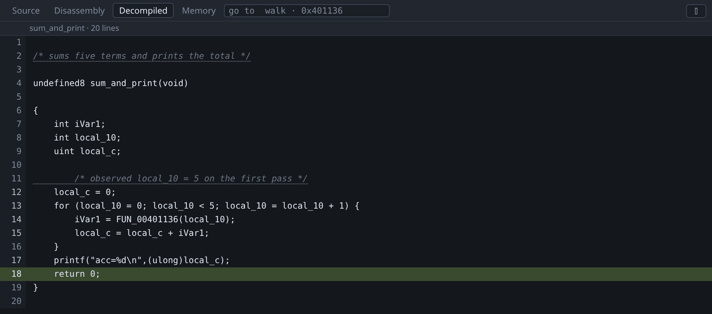

# Agents

`gdb-wui -mcp` serves [MCP](https://modelcontextprotocol.io) on stdio for an
already-running gdb-wui, so an agent can read the binary, drive the debugger and
write down what it worked out. Point Claude Code, or any MCP client, at it:

```sh
claude mcp add gdb-wui -- gdb-wui -mcp -mcp-annotate -mcp-run
```

Start gdb-wui as usual first — the bridge joins a session, it does not create
one:

```sh
mkdir -p /tmp/tour && cp testdata/fixtures/nodebug.c /tmp/tour/
gcc -O0 -no-pie -o /tmp/tour/nodebug /tmp/tour/nodebug.c && strip /tmp/tour/nodebug
./gdb-wui -project /tmp/tour -exe nodebug -ghidra ~/ghidra_12.1.2_PUBLIC
```

That is the binary in the screenshot below: `nodebug.c` with no debug info and
no symbol table, which is the case an agent is actually useful for. Point it at
your own program the same way.



The screenshot above shows live updates to the decompilation made by an agent:
the function's name and both comments, written through the bridge. The pane
repainted by itself, as edits are broadcast to open tabs.

## Why this needs a running program

An agent can point a decompiler at a binary anywhere. What it cannot usually do
is **check**. Here it can set a breakpoint, run to it, and read what is actually
in the variable:

> `decompile_function` says `local_c` is a `uint` and gives an expression for
> it. `set_breakpoint`, `run`, `evaluate` — it holds 84 at this point, which is
> the running total and not a length. `comment` says so, on that line, for next
> time.

Every step of that is a tool call, and the conclusion outlives the session
because it goes into the Ghidra project.

## The three permissions

Reading a binary, writing into your Ghidra project and running your program are
three different things to agree to, so they are three flags. `-mcp` alone is
read-only.

| flag | what it adds |
|---|---|
| `-mcp` | Decompile, disassemble, read the stack, locals, registers, memory and expressions. Changes nothing. |
| `-mcp-annotate` | Rename, retype and comment, in the decompiler's database. |
| `-mcp-run` | Set breakpoints; run, step, finish and pause the program. |

A tool you have not permitted is not offered to the model at all, and is refused
if it is called anyway.

Four things are absent whatever you pass: writing to the program's memory,
assigning to a variable, writing a register, and the gdb console. The console
runs any gdb command, so permitting it would make the other three flags
meaningless.

{: .warning }
> `-mcp-run` runs your program with your privileges, on the agent's initiative.
> That is what a debugger does, and it is why it is a separate flag from
> reading. Do not pass it for a binary you would not run yourself.

## The order to call the tools in

`status` first: what is loaded, whether the program is stopped, whether the
decompiler is ready. Then `wait_for_decompiler`, because Ghidra takes seconds on
a small program and minutes on firmware and can answer nothing until it has
finished.

On a stripped binary there is nothing to list — `list_symbols` is empty, which
is the whole reason the rest exists. The way in is the stack: `stack`,
`name_addresses` to find which frames the decompiler knows, then
`decompile_function` on one of them and the `FUN_` names in the recovered C
lead to the rest.

**The tools that run the program return the stop**, not an acknowledgement.
`run` answers with where it stopped and why; there is nothing to poll, and
nothing else can be read while the program is running. If a call comes back
"still running", the program is waiting for input or in a loop, and `pause`
stops it.

**The tools that write answer with the function decompiled again**, for the same
reason. An edit is not local to what it touched: a prototype changes how every
caller reads, and a type reshapes the body around it — typing a table as an
array can merge or retire the very variable that indexes it. So the reply is the
new view, and the next edit is built from that rather than from the
decompilation before it. An edit naming a variable the function no longer has is
refused, and the refusal lists the names it does have.

## Reading what an agent wrote

Everything it writes is marked, in gdb-wui and in Ghidra.

- **Names and types** are recorded as *inferred* rather than as something you
  stated — Ghidra's `ANALYSIS` source type, which its own UI shows. The
  right-click menu says so before you replace one.
- **Comments** are marked with a Ghidra bookmark, so the note is exactly the
  text that was written and the authorship travels beside it. In the Decompiled
  tab an agent's comment is underlined and says so on hover.

Rewriting an agent's comment yourself takes it over: what is on the page
afterwards is yours.

Nothing here is a symbol: a name an agent chose is not one the binary carries,
any more than `FUN_00401154` is, so the call stack shows both in italics.

## Undoing an agent's edits

`Ctrl+Shift+Z` undoes one edit. An agent writes in bursts, so consecutive edits
by one author form a **run**, and right-clicking in the Decompiled tab offers
*Undo the agent's last N edits* — the whole burst, in one step. A run is
reversed newest-first through the same path a single undo takes.

Only the most recent run can be undone. Each inverse was worked out against the
state its edit left behind, so taking an older one back first would put a name
over something later renamed.

## How the bridge works

The bridge is a client of the running gdb-wui, not a second way into gdb. It
reads the same 0600 run file `-print-url` reads, mints a
login the same way, and joins the same WebSocket your browser is on; every tool
is one request from [the protocol](https://github.com/retrocpugeek/gdb-wui/blob/master/docs/protocol.md).

That is not an implementation detail so much as the safety argument. The refusal
to write to a project you named with `-ghidra-project`, the rule that nothing
may be read while the program runs, the translation between runtime and
link-time addresses, the undo journal, the broadcast that repaints open tabs —
an agent gets all of it because there is no other way in.

## What it does not do

- **It brings no model.** gdb-wui makes no network requests of its own and holds
  no API key; whatever you point at it does that, under your own account.
- **It does not enumerate Ghidra's functions.** `list_symbols` reads the
  binary's symbol table, which a stripped file does not have. An agent explores
  from the stack and from call targets in the recovered C.
- **It does not edit struct fields**, for the same reason
  [renaming](decompilation.md) does not.
- **It does not run without a server.** Start gdb-wui first; the bridge exits
  saying so if there is nothing to join. With several running, `-addr` chooses.
