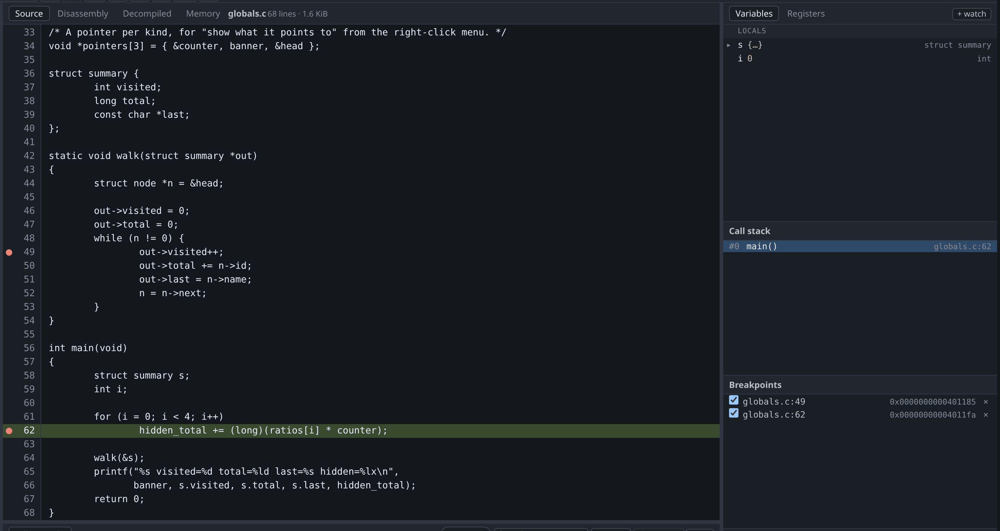
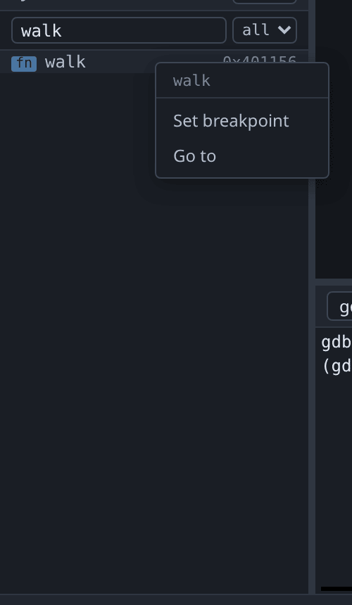

# Breakpoints

To set a breakpoint on a source line, click the line number.



The dot in the gutter and the row in the **Breakpoints** pane are the same
breakpoint shown twice; the pane mirrors what gdb holds rather than tracking
what the UI did. To remove a breakpoint, click the gutter again, or click the
`×` in the pane. To disable one without deleting it, clear its checkbox.

The gutters in the [disassembly](disassembly.md) and
[decompiled](decompilation.md) views work the same way, except that they set a
breakpoint on an **address** rather than on a line.

## Breaking on a function with no source

To break on a function when you have no source for it, right-click the function
in the [Symbols pane](symbols.md) and choose **Set breakpoint**.



## Breaking by name and breaking at an address

Breaking on a function by name and breaking at its address stop at different
instructions.

When you give a name, gdb skips the function prologue, using the line table or a
heuristic to find the first instruction after the frame is set up. On a MIPS
firmware, for example, `break process_packet` stops at entry+24, after the
register spills. Use this when you want to inspect arguments and locals, because
by then they have been stored somewhere you can read.

When you give an address, gdb stops exactly there. At a function's entry that is
before the frame exists and before any argument has been stored, so the
Variables pane will show values that are not yet meaningful. Use this when you
want to see the prologue itself, or to catch a jump into the middle of a
function.

| To do this | Use |
|---|---|
| Inspect arguments and locals | The name; let gdb skip the prologue. |
| See the prologue, or catch a jump into a function | The address. |

A [decompiler](decompilation.md) name — `FUN_0010e2dc`, or whatever you have
renamed it to — works here too, and behaves like the address rather than like
the name: gdb has never heard of it, so the server resolves it through Ghidra
and breaks on the entry instruction. On a stripped binary that is often where
you want to be anyway. There is no prologue to skip past *to* — no line table
and no locals to wait for — and the arguments are still in the registers the
calling convention put them in, which on that binary is the only place you were
going to read them.

## Pending breakpoints

A breakpoint on a file or symbol that gdb does not yet know about is accepted
and marked pending. It resolves when a shared library loads, or when a program
is loaded. The Breakpoints pane shows pending breakpoints differently so that
you can tell an unresolved breakpoint from one that will be hit.

## Worked example

```sh
gcc -g -O0 -no-pie -o /tmp/tour/globals testdata/fixtures/globals.c
./gdb-wui -project /tmp/tour -exe globals
```

Click line 49. Then set the same breakpoint both other ways at the gdb console
and compare the addresses:

```
(gdb) break walk
Breakpoint 1 at 0x401162: file globals.c, line 44.
(gdb) break *walk
Breakpoint 2 at 0x401156: file globals.c, line 43.
```

They are twelve bytes and one line apart. Breakpoint 2 is on the opening brace,
before `out` has been stored anywhere; breakpoint 1 is on the first statement,
where the parameter can be read. Both appear in the Breakpoints pane with their
addresses beside them.

## What breakpoints do not do

- **Watchpoints, catchpoints and tracepoints** have no UI. gdb supports all
  three, and they work when typed into the [console](console.md); a watchpoint
  set that way even appears in the Breakpoints pane, because gdb announces it
  the same way it announces a breakpoint.
- **Conditions and hit counts** have no UI either. Use `condition` and `ignore`
  at the console; they apply to a breakpoint set by clicking.
