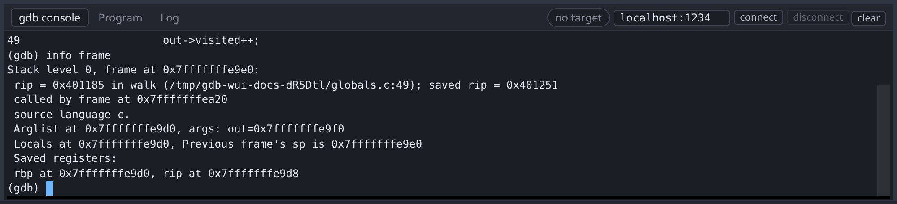
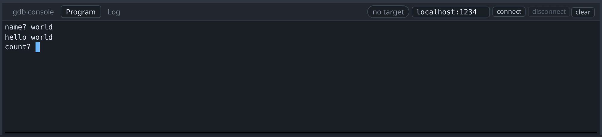
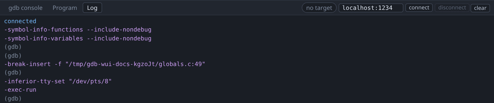

# Console, terminal and log

The three tabs along the bottom of the window show three different streams.

## gdb console



This is a real gdb console. Any gdb command can be typed into it, including
everything gdb-wui has no buttons for: `watch`, `condition`, `set var`,
`info proc mappings`, and commands you have defined yourself.

Tab completes, and `↑` recalls history.

Commands typed here are not second-class. Setting a breakpoint with `break` puts
it in the [Breakpoints pane](breakpoints.md), because that pane mirrors gdb
rather than tracking what the UI did.

The console also works while the program is running, so it remains available in
states the rest of the UI does not model.

## Program



This tab is the terminal of the program being debugged. It is a pty rather than
a pipe, which matters for buffering: `printf("name? ")` has no trailing newline,
so on a pipe libc would block-buffer it and the prompt would not appear, while
on a tty libc line-buffers and it appears immediately. The program therefore
behaves as it does in your shell, and typing here reaches its stdin.

Inside a terminal panel, gdb-wui intercepts only the function keys and
`Ctrl+Shift+…`, so `Ctrl+C`, `Ctrl+D`, Tab and the arrow keys all reach your
program.

## Log



The Log tab shows diagnostics about gdb-wui itself, of three kinds:

- **The decompiler's activity**, always. One line per operation, with timings;
  see [decompilation](decompilation.md).
- **gdb's own log stream**, the messages that are not answers to a command.
- **Raw GDB/MI traffic**, only when gdb-wui is started with `-mi-log`. Both
  directions are shown exactly as they went over the wire. This is behind a flag
  because it is every line of the conversation, rather than one line per
  operation.

Use `-mi-log` when the UI and gdb appear to disagree: it shows what was actually
asked and actually answered.

## Worked example

Break anywhere in the tour's program, then at the console:

```
(gdb) info frame
(gdb) p ratios
(gdb) watch counter
```

The watchpoint has no UI in gdb-wui, and it still appears in the Breakpoints
pane, labelled `counter` with no address, because gdb announces it with the same
`=breakpoint-created` it uses for breakpoints. You can disable and delete it
from the pane like anything else.

## What the console, terminal and log do not do

- **The Program tab is not a full terminal emulator.** Line-oriented programs
  work; a curses application will not render correctly.
- **The console adds no scripting or macros** beyond gdb's own.
- **The Log tab does not filter or search.** It keeps a bounded number of lines
  and drops the oldest.
