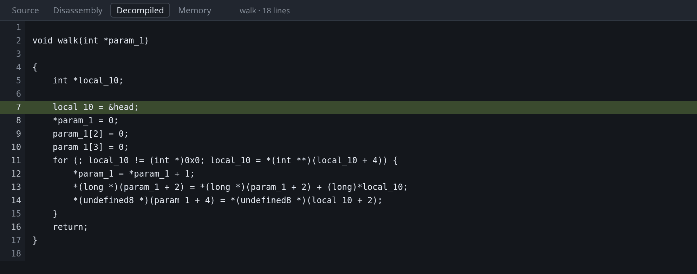
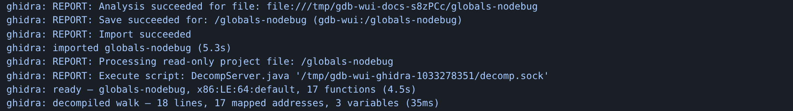

# Decompilation

The Decompiled tab shows Ghidra's recovered C for the function you are stopped
in, with the program counter marked in it. It is for binaries with no source.



The screenshot shows `walk` from the tour's program with its debug info removed.
The parameter is called `param_1` and the local `local_10`, because those names
were in the DWARF that was stripped. `&head` is still `&head`, because the ELF
symbol table survived and Ghidra reads that too. On a fully stripped binary
every function is named after its address, such as `FUN_00401156`.

This tab needs the `-ghidra` argument. See
[Install](../install.md#installing-ghidra-optional).

## Stepping in the decompiled view

gdb's own stepping needs a line table. Without one its step range is the whole
function, so `F10` runs to the end of the function.

While this tab is showing, a step moves to the next decompiled line instead,
using Ghidra's address map in place of the missing line table. The gutter also
sets breakpoints, by address.

## How the program counter is marked

Recovered C is a model of the program rather than its source, so the pane
distinguishes how confident the mapping is:

- **Filled** — a decompiled line claims the program counter's address exactly.
- **Outlined**, with `pc between lines` in the header — no line claims the
  address, and this is the nearest line below it. Prologues, epilogues and
  register spills belong to no expression, so this is normal.
- **Marked ambiguous** — more than one line claims the address. Optimised code
  merges statements, and the map cannot separate them again.

A local that the decompiler invented, which lives nowhere in the machine, shows
no value rather than a wrong one. Around two thirds of recovered locals live in
a register that is only correct near one program counter, whereas a global at a
fixed address is valid at every one, so globals are the ones you can rely on.

## Following what Ghidra is doing



The **Log** tab shows Ghidra's activity: what it imported, how long analysis
took, one line per decompiled function with its timing, and Ghidra's own
messages. Unlike the raw MI stream this is not behind a flag, because it is one
line per operation and it is the only way to tell a slow start from a stuck one.

Import and analysis take seconds for a small program and minutes for firmware.
The result is cached under `<project>/gdb-wui-decomp`, keyed on the binary's
SHA-256, so later runs are immediate.

## Using an existing Ghidra project

To use names and types you have already created in Ghidra, pass the project and
the program within it:

```sh
./gdb-wui -project . -exe firmware \
  -ghidra-project ~/ghidra-projects/firmware-re.gpr \
  -ghidra-program firmware
```

The project is opened read-only, so your names and types are used but nothing is
written back. `-ghidra-program` is required, because a Ghidra project usually
holds several programs.

## Worked example

```sh
gcc -g -O0 -no-pie -o /tmp/tour/globals-nodebug testdata/fixtures/globals.c
objcopy --strip-debug /tmp/tour/globals-nodebug
./gdb-wui -project /tmp/tour -exe globals-nodebug -ghidra ~/ghidra
```

Filter the [Symbols pane](symbols.md) to `walk`, right-click it, choose **Set
breakpoint**, and press Run. Open **Decompiled**: the first time, the Log tab
shows the import and analysis; afterwards it is immediate.

You stop in the prologue, so the header says `pc between lines`. Press `F10`
twice and the marker becomes a solid highlight on `local_10 = &head;`. In the
[source](../tour.md) that line is `struct node *n = &head;`.

## What decompilation does not do

- **It does not edit Ghidra's names or types.** Rename in Ghidra and reload.
- **It does not decompile a function you are not stopped in.** Break in it
  first.
- **It does not reproduce the source.** Recovered C compiles to the same
  behaviour, not to the same text: loop shapes change, variables merge, and
  types are inferred. Read it as a model.
- **It does nothing without Ghidra**, and prints no warning until you open the
  tab.
