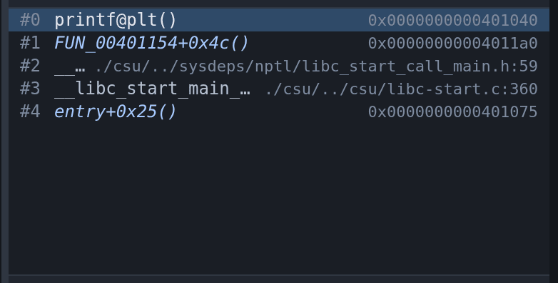
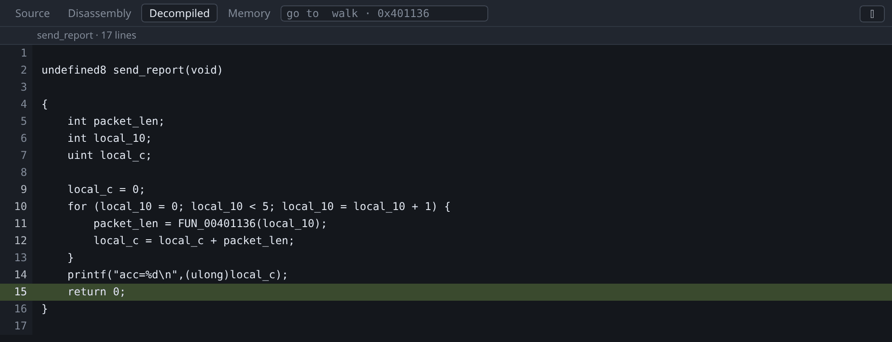
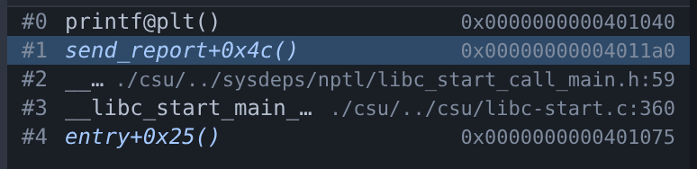

# Decompilation

The Decompiled tab shows Ghidra's recovered C for the function you are stopped
in, with the program counter marked in it. It is for binaries with no source.


The screenshot shows `walk` from the tour's program with its debug info removed.
The parameter is called `param_1` and the local `local_10`, because those names
were in the DWARF that was stripped. `&head` is still `&head`, because the ELF
symbol table survived and Ghidra reads that too. On a fully stripped binary
every function is named after its address, such as `FUN_00401156`.

This tab needs the `-ghidra` argument. See
[Install](../install.md#installing-ghidra-optional).

To decompile a particular function rather than the one being executed, type its
name or an address into the go-to box at the right of the tab strip. See
[going somewhere](source.md#going-somewhere).

## Naming the call stack

gdb has no symbol for a stripped binary's own functions, so every frame inside
the program reads `?? ()`. The decompiler does know what is there, and the names
are filled in once it has finished analysing.



Recovered names are *italic*, and hovering one shows the recovered prototype.
They are marked because they are not symbols: `FUN_00401154` is obviously a
guess, but a function you have renamed in Ghidra is not, and a stack that showed
the two alike would be claiming knowledge it does not have.

Three details in that screenshot are the whole behaviour:

- `#1` and `#4` are the program's own functions. gdb had nothing; these names
  and the `+0x4c` offsets come from Ghidra. The offset matters — every frame
  but the innermost is a return address partway through a function, and a bare
  name would be equally true of a hundred instructions.
- `#2` and `#3` are libc, named by gdb from libc's own symbols and left alone. A
  real symbol beats a recovered one.
- `#0` is `printf@plt`, which is *inside* the program, so the decompiler has a
  name for it too — and it is not used, for the same reason.

Names appear when analysis finishes, so the stack changes under you the first
time you stop in a binary Ghidra has not seen before. Nothing needs to be open
for this: the Decompiled tab can stay shut, and passing `-ghidra` is the opt-in.

Renaming a function shows your name here, which is what makes working through
unfamiliar firmware get easier rather than staying equally hard — and you can
rename it from the stack row itself, without leaving gdb-wui.

## Renaming what the decompiler guessed

`FUN_00401154`, `local_10` and `undefined8` are not wrong: they are what can be
known without a symbol table. But a reader holds a program in their head by its
names, and a page of invented ones is the single biggest obstacle to reading
recovered C.



Right-click a name in the Decompiled tab:

- **Rename `local_10`…** — the local or the global under the pointer. A
  decompiler temporary can be renamed too, even though it has no value to show.
- **Set the type of `local_10`…** — any C type Ghidra can parse. Getting a type
  right often reshapes the whole function body, which is the point.
- **Rename the function…** and **Edit the prototype…** — the prototype covers
  the return type, the parameters and the name in one go.

Right-clicking a recovered frame in the call stack offers the same rename, which
is usually where an unhelpful name is first met.

Type the new name and press Enter. `Ctrl+Shift+Z` undoes the last edit.

The names go into the Ghidra project, not into anything gdb-wui invented, so
everything that asks the decompiler gets the new answer at once — the pane, the
call stack, the symbol list, and any other browser tab open on the same session.
They are saved immediately and are there the next time you debug that binary.



That is the same stack as the one above, after the rename: `#1` was
`FUN_00401154+0x4c()`.

A renamed function still shows as *recovered* in the call stack. A name you
typed is no more a symbol than `FUN_00401154` was; presenting it as one would be
the same claim in better handwriting.

The project is keyed on the binary's SHA-256, so **a rebuilt binary starts
again** with a fresh analysis and none of your names. That is deliberate —
reading one build's names against another build's addresses is a confidently
wrong answer — but it does mean the naming is worth doing on a binary you are
going to keep.

## Stepping in the decompiled view

gdb's own stepping needs a line table. Without one its step range is the whole
function, so `F10` runs to the end of the function.

While this tab is showing, a step moves to the next decompiled line instead,
using Ghidra's address map in place of the missing line table. The gutter also
sets breakpoints, by address.

To read the recovered C against the instructions it came from, rather than
switching between them, [split the centre view](source.md#two-views-at-once).
With both showing, the focused one decides how stepping behaves.

## How the program counter is marked

Recovered C is a model of the program rather than its source, so the pane
distinguishes how confident the mapping is:

- **Filled** — a decompiled line claims the program counter's address exactly.
- **Outlined**, with `pc between lines` in the header — no line claims the
  address, and this is the nearest line below it. Prologues, epilogues and
  register spills belong to no expression, so this is normal.
- **Marked ambiguous** — more than one line claims the address. Optimised code
  merges statements, and the map cannot separate them again.

A local that the decompiler invented, which lives nowhere in the machine, shows
no value rather than a wrong one. Around two thirds of recovered locals live in
a register that is only correct near one program counter, whereas a global at a
fixed address is valid at every one, so globals are the ones you can rely on.

## Following what Ghidra is doing


The **Log** tab shows Ghidra's activity: what it imported, how long analysis
took, one line per decompiled function with its timing, and Ghidra's own
messages. Unlike the raw MI stream this is not behind a flag, because it is one
line per operation and it is the only way to tell a slow start from a stuck one.

Import and analysis take seconds for a small program and minutes for firmware.
The result is cached under `<project>/gdb-wui-decomp`, keyed on the binary's
SHA-256, so later runs are immediate.

## Using an existing Ghidra project

To use names and types you have already created in Ghidra, pass the project and
the program within it:

```sh
./gdb-wui -project . -exe firmware \
  -ghidra-project ~/ghidra-projects/firmware-re.gpr \
  -ghidra-program firmware
```

Your names and types are used and **nothing is written back**: renaming is
disabled for a project you named, and the menu items say so. gdb-wui only edits
the project it imported itself. `-ghidra-program` is required, because a Ghidra
project usually holds several programs.

## Worked example

```sh
gcc -g -O0 -no-pie -o /tmp/tour/globals-nodebug testdata/fixtures/globals.c
objcopy --strip-debug /tmp/tour/globals-nodebug
./gdb-wui -project /tmp/tour -exe globals-nodebug -ghidra ~/ghidra
```

Filter the [Symbols pane](symbols.md) to `walk`, right-click it, choose **Set
breakpoint**, and press Run. Open **Decompiled**: the first time, the Log tab
shows the import and analysis; afterwards it is immediate.

You stop in the prologue, so the header says `pc between lines`. Press `F10`
twice and the marker becomes a solid highlight on `local_10 = &head;`. In the
[source](../tour.md) that line is `struct node *n = &head;`.

## What decompilation does not do

- **It does not edit a project you named.** `-ghidra-project` is read-only:
  renaming works only in the project gdb-wui imports for itself.
- **It does not edit struct fields.** Names, variable types and function
  prototypes, but not the members of a type.
- **It does not name anything but the call stack.** The Threads pane shows a
  frame per thread and leaves gdb's `??` on it.
- **It does not name a frame outside the program.** libc and the dynamic loader
  are not in the binary Ghidra was given, so their frames keep whatever gdb
  says — usually a real symbol, sometimes nothing.
- **It does not reproduce the source.** Recovered C compiles to the same
  behaviour, not to the same text: loop shapes change, variables merge, and
  types are inferred. Read it as a model.
- **It does nothing without Ghidra**, and prints no warning until you open the
  tab.
