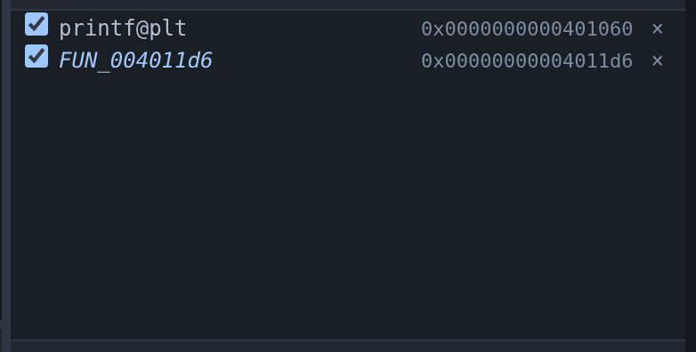
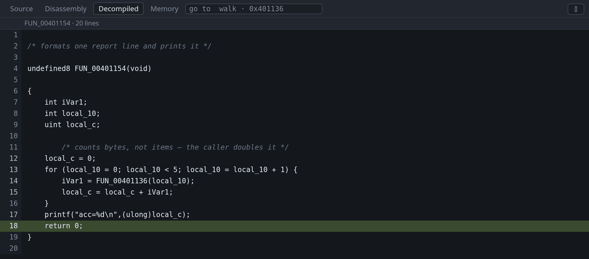

# Decompilation

The Decompiled tab shows Ghidra's recovered C for the function you are stopped
in, with the program counter marked in it. It is for binaries with no source.


The screenshot shows `walk` from the tour's program with its debug info removed.
The parameter is called `param_1` and the local `local_10`, because those names
were in the DWARF that was stripped. `&head` is still `&head`, because the ELF
symbol table survived and Ghidra reads that too. On a fully stripped binary
every function is named after its address, such as `FUN_00401156`.

This tab needs the `-ghidra` argument. See
[Install](../install.md#installing-ghidra-optional).

To decompile a particular function rather than the one being executed, type its
name or an address into the go-to box at the right of the tab strip. See
[jumping to a file, symbol or address](source.md#jumping-to-a-file-symbol-or-address).

## Naming the call stack

Frames that gdb cannot name are named by the decompiler, once it has finished
analysing. Without it every frame inside a stripped binary reads `?? ()`.


Recovered names are *italic*, and hovering one shows the recovered prototype.
They are marked because they are not symbols: `FUN_00401154` is obviously a
guess, but a function you have renamed in Ghidra is not, and a stack that showed
the two alike would be claiming knowledge it does not have.

Three details in that screenshot:

- `#1` and `#4` are the program's own functions. gdb had nothing; these names
  and the `+0x4c` offsets come from Ghidra. The offset matters — every frame
  but the innermost is a return address partway through a function, and a bare
  name would be equally true of a hundred instructions.
- `#2` and `#3` are libc, named by gdb from libc's own symbols and left alone. A
  real symbol beats a recovered one.
- `#0` is `printf@plt`, which is *inside* the program, so the decompiler has a
  name for it too — and it is not used, for the same reason.

Names appear when analysis finishes, so the stack changes under you the first
time you stop in a binary Ghidra has not seen before. Nothing needs to be open
for this: the Decompiled tab can stay shut, and passing `-ghidra` is the opt-in.

Renaming a function shows your name here, so a stack you have already worked
through reads in your own names — and you can rename it from the stack row
itself, without leaving gdb-wui.

## Following a call

Right-click a name in the decompiled text to set a breakpoint on it or jump to
it. The body of a recovered function is full of names that exist nowhere else —
`FUN_004011d6` for a function it calls, `DAT_00404040` for a global it reads —
and the menu offers what to do with each:

- **Set breakpoint at `FUN_004011d6`** — the breakpoint appears in the
  [Breakpoints pane](breakpoints.md) named the same way rather than as a bare
  address.
- **Go to `FUN_004011d6`** — the disassembly for a function, the
  [memory viewer](memory.md) for a global.



The name is resolved before the menu opens, so an item appears only where there
is somewhere to go: a type name or a keyword under the pointer offers nothing.
A name the binary itself carries is resolved by gdb, which means a breakpoint on
one skips the prologue; a name only Ghidra has is resolved through the
decompiler and breaks at the entry instruction. See
[breaking by name and breaking at an address](breakpoints.md#breaking-by-name-and-breaking-at-an-address).

The address is not the digits in the name. Those are where Ghidra found the
function at link time, and a position-independent executable is somewhere else
entirely once it is running.

## Renaming variables and functions

Rename a decompiler-invented name by right-clicking it in the Decompiled tab.
`FUN_00401154`, `local_10` and `undefined8` are not wrong — they are what can be
known without a symbol table — but a reader holds a program in their head by its
names.


Right-click a name in the Decompiled tab:

- **Rename `local_10`…** — the local or the global under the pointer. A
  decompiler temporary can be renamed too, even though it has no value to show.
- **Set the type of `local_10`…** — any C type Ghidra can parse. Getting a type
  right often reshapes the whole function body, which is the point.
- **Rename the function…** and **Edit the prototype…** — the prototype covers
  the return type, the parameters and the name in one go.
- **Watch `local_10`** — keep the value in the [Variables pane](variables.md),
  re-read at every stop. A global is the one to reach for: a fixed address is
  valid at every program counter, so the watch goes on reading however far you
  step. It arrives typed as whatever the decompiler believes, which is often
  `undefined8`, and the pane can [cast it](variables.md#adding-removing-and-casting-a-watch).

Right-clicking a recovered frame in the call stack offers the same rename, which
is usually where an unhelpful name is first met.

Type the new name and press Enter. `Ctrl+Shift+Z` undoes the last edit.

The names go into the Ghidra project, not into anything gdb-wui invented, so
everything that asks the decompiler gets the new answer at once — the pane, the
call stack, the symbol list, and any other browser tab open on the same session.
They are saved immediately and are there the next time you debug that binary.


That is the same stack as the one above, after the rename: `#1` was
`FUN_00401154+0x4c()`.

A renamed function still shows as *recovered* in the call stack. A name you
typed is still not a symbol the binary carries, so it is still drawn as one the
decompiler supplied.

The project is keyed on the binary's SHA-256, so **a rebuilt binary starts
again** with a fresh analysis and none of your names. That is deliberate —
reading one build's names against another build's addresses is a confidently
wrong answer — but it does mean the naming is worth doing on a binary you are
going to keep.

## Adding comments to the decompilation

Comments can be added to the decompilation by right-clicking in the Decompiled
tab. There is no source file to write them in, and re-reading the recovered C
will not give back what you worked out.



- **Comment this line…** — a note above that line. Right-clicking a comment
  offers **Edit the comment on this line…** instead, opening on what you typed,
  and **Remove the comment on this line**.
- **Comment the function…** — a note above the whole function, where its
  purpose belongs.

A line that came from no address — a brace, a declaration, a blank — cannot
hold a comment, because there is nothing to attach one to. Those are the same
lines that cannot hold a breakpoint, and the gutter already shows which they
are.

Comments are stored in the Ghidra project alongside the names, so they are
there next time, and `Ctrl+Shift+Z` undoes the last one. They are also
*Ghidra's* comments: open the same project in Ghidra and they are in the
Listing and the Decompiler windows, where you would expect them.

Comments go on a line or on a function, one line of text at a time. Longer
notes wrap when the decompiler prints them.

## Stepping in the decompiled view

Step by decompiled line with `F10`, the same key as everywhere else. gdb's own
stepping needs a line table, and without one its step range would be the whole
function.

While this tab is showing, a step moves to the next decompiled line instead,
using Ghidra's address map in place of the missing line table. The gutter also
sets breakpoints, by address.

To read the recovered C against the instructions it came from, rather than
switching between them, [split the centre view](source.md#two-views-at-once).
With both showing, the focused one decides how stepping behaves.

## How the program counter is marked

The pane marks the current line one of three ways, according to how well the
recovered C maps to the address. Recovered C is a model of the program rather
than its source, so the mapping is not always exact:

- **Filled** — a decompiled line claims the program counter's address exactly.
- **Outlined**, with `pc between lines` in the header — no line claims the
  address, and this is the nearest line below it. Prologues, epilogues and
  register spills belong to no expression, so this is normal.
- **Marked ambiguous** — more than one line claims the address. Optimised code
  merges statements, and the map cannot separate them again.

A local that the decompiler invented, which lives nowhere in the machine, shows
no value rather than a wrong one. A local on the stack needs one thing more: a
rule turning the decompiler's frame offsets into an address, measured against a
live inferior on x86, ARM, AArch64, PowerPC and MIPS. Outside those, or in a
frame whose depth Ghidra cannot settle on, a stack local shows no value either.
Around two thirds of recovered locals live in a register that is only correct
near one program counter, whereas a global at a fixed address is valid at every
one, so globals are the ones you can rely on.

## Watching the import and analysis


The **Log** tab shows Ghidra's activity: what it imported, how long analysis
took, one line per decompiled function with its timing, and Ghidra's own
messages. Unlike the raw MI stream this is not behind a flag, because it is one
line per operation and it is the only way to tell a slow start from a stuck one.

Import and analysis take seconds for a small program and minutes for firmware.
The result is cached under `<project>/gdb-wui-decomp`, keyed on the binary's
SHA-256, so later runs are immediate.

## Images too big to analyse

Past 4 MB of code, gdb-wui imports the image without Ghidra's analysis and
disassembles each function as it is opened. Nothing is needed from you; the log
says when it happens. Import drops to seconds, and the first time you open a
function costs a few tens of milliseconds more than the times after it.

The reason is that Ghidra's analysis walks the whole image — disassembling
everything, propagating constants between functions, building the
cross-references — and past a few megabytes of code that stops finishing. A
12 MB MIPS64 kernel, 6.9 MB of it code, exhausts `analyzeHeadless`'s 2 GB heap
and the import fails outright.

What you keep is what the decompiler produces on its own: the C, the variables,
the stack rule and every function in the symbol table — a kernel arrives with
all 22,000 of them named. What you lose is the whole-program work:
cross-references, recovered parameter types, and strings identified as strings.

An image with no symbol table has nothing to list this way, so `auto` takes
`lean` for that case instead: the analyzers that find functions, without the
ones that cost the memory. They arrive named after their addresses, because
nothing knows what they were called. If something else does — a kernel's own
`kallsyms`, or `nm` output from an unstripped build — `-ghidra-symbols` takes a
file of `address [type] name` lines and names them.
See [debugging a kernel](kernel.md#a-stripped-kernel), which is where both of
these come up.

`-ghidra-analysis` overrides the choice — `full` to analyse anyway and wait,
`none` to skip it on a smaller binary. Raising Ghidra's heap raises the ceiling
too: `GHIDRA_MAXMEM=8G` is passed through to the Ghidra gdb-wui spawns. Each
kind of project is cached separately, so switching either flag re-imports
rather than handing back the one you already have.

## Using an existing Ghidra project

To use names and types you have already created in Ghidra, pass the project and
the program within it:

```sh
./gdb-wui -project . -exe firmware \
  -ghidra-project ~/ghidra-projects/firmware-re.gpr \
  -ghidra-program firmware
```

Your names, types and comments are used and **nothing is written back**:
renaming and commenting are disabled for a project you named, and the menu items
say so. gdb-wui only edits
the project it imported itself. `-ghidra-program` is required, because a Ghidra
project usually holds several programs.

To see it work without a project of your own, the [decompilation
reference](https://github.com/retrocpugeek/gdb-wui/blob/master/docs/decompilation.md)
builds one with `analyzeHeadless` from an example program and points gdb-wui at
that.

## Worked example

```sh
mkdir -p /tmp/tour && cp testdata/fixtures/globals.c /tmp/tour/
gcc -g -O0 -no-pie -o /tmp/tour/globals-nodebug /tmp/tour/globals.c
objcopy --strip-debug /tmp/tour/globals-nodebug
./gdb-wui -project /tmp/tour -exe globals-nodebug -ghidra ~/ghidra
```

Filter the [Symbols pane](symbols.md) to `walk`, right-click it, choose **Set
breakpoint**, and press Run. Open **Decompiled**: the first time, the Log tab
shows the import and analysis; afterwards it is immediate.

You stop in the prologue, so the header says `pc between lines`. Press `F10`
twice and the marker becomes a solid highlight on `local_10 = &head;`. In the
[source](../tour.md) that line is `struct node *n = &head;`.

## What decompilation does not do

- **It does not edit a project you named.** `-ghidra-project` is read-only:
  renaming works only in the project gdb-wui imports for itself.
- **It does not edit struct fields.** Names, variable types, function
  prototypes and comments, but not the members of a type.
- **It does not name every pane.** It names the [call stack](#naming-the-call-stack),
  the [symbol pane](symbols.md), the [breakpoint list](breakpoints.md), a
  [watch on an address](variables.md#watching-something-from-the-decompiled-view)
  and the [memory viewer](memory.md#naming-addresses-in-a-stripped-binary)'s
  symbol column. The Threads pane shows a frame per thread and leaves gdb's
  `??` on it.
- **It does not know how far an untyped label runs**, so the memory column names
  such a label on its own row and nothing after it. Ghidra represents an
  unexamined byte as one undefined item whatever follows it; giving the label a
  type is what establishes the extent, and then the whole object is named.
- **It does not name a frame outside the program.** libc and the dynamic loader
  are not in the binary Ghidra was given, so their frames keep whatever gdb
  says — usually a real symbol, sometimes nothing.
- **It does not reproduce the source.** Recovered C compiles to the same
  behaviour, not to the same text: loop shapes change, variables merge, and
  types are inferred. Read it as a model.
- **It does nothing without Ghidra**, and prints no warning until you open the
  tab.
- **It does not analyse a large image**, and says so: past 4 MB of code the
  import skips Ghidra's analysis, which costs cross-references and recovered
  parameter types.
  See [images too big to analyse](#images-too-big-to-analyse).
