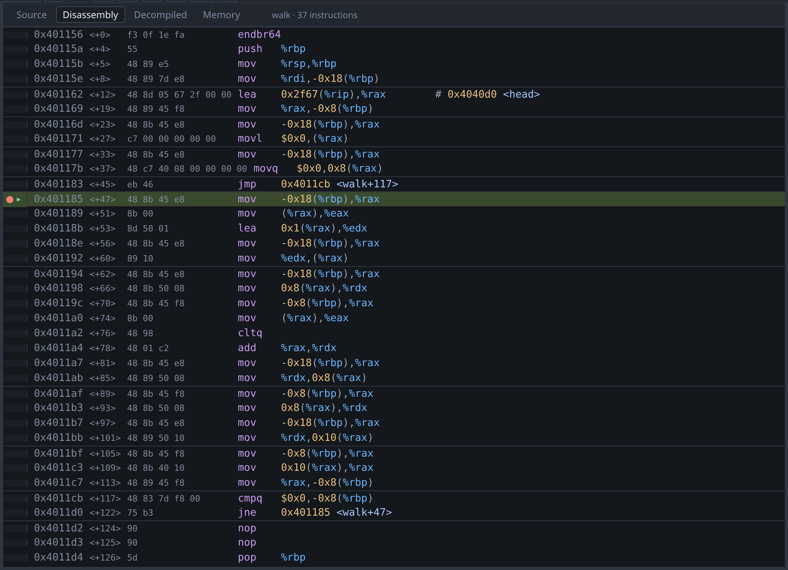

# Disassembly



The Disassembly tab shows the function containing the program counter, and
follows it as you step. Each row has the address, the offset from the start of
the function, the opcode bytes, and the instruction. Registers, immediates and
symbols are coloured differently so that operands are easier to scan.

The `▸` in the gutter marks the program counter, and the dot beside it marks a
breakpoint. Clicking the gutter sets a breakpoint on an **address**, which is
not the same as setting one on a line; see [breakpoints](breakpoints.md).

Faint rules separate the instructions belonging to each source line, when there
is a line table to say where the boundaries are. Without one the listing is
continuous.

gdb annotates operands where it can: the `# 0x4040d0 <head>` on the `lea` in the
screenshot is gdb resolving a rip-relative operand to a symbol. Hovering a
register reads it, and hovering an annotation reads the symbol; see
[hover](variables.md).

To read the instructions and the recovered C together, rather than switching
between them, [split the centre view](source.md#two-views-at-once).

## Pinning the view to a function

The view normally follows the program counter. To look at a different function,
type its name into the go-to box at the right of the tab strip — see
[going somewhere](source.md#going-somewhere) — or double-click a symbol in the
[Symbols pane](symbols.md). Either pins the view there, so that switching to
this tab does not jump back to the program counter.
The pin is dropped at the next stop, because the program counter has then moved
and following it is useful again.

## Worked example

Build a binary with nothing to go on:

```sh
mkdir -p /tmp/tour && cp testdata/fixtures/nodebug.c /tmp/tour/
gcc -O0 -no-pie -o /tmp/tour/nodebug /tmp/tour/nodebug.c && strip /tmp/tour/nodebug
./gdb-wui -project /tmp/tour -exe nodebug
```

There is no source and none of the program's own symbols. `strip` removes
`.symtab` but leaves the dynamic symbol table, so the Symbols pane still lists
the library stubs — `printf@plt` and a few others — and nothing that was written
in this program. There is no `main` to break on.

Press **Run→entry**, because the entry point is the one address you know exists.
The disassembly is then the only view with anything in it, and `Alt+F11` steps
one instruction at a time.

If you want more than this, see [decompilation](decompilation.md).

## What the disassembly does not do

- **It does not edit or patch.** There is no assembler and no way to write
  bytes.
- **It does not draw a control-flow graph.** The listing is linear.
- **It does not show cross-references.** It cannot answer "what calls this".
- **It does not switch to Intel syntax by itself.** Run
  `set disassembly-flavor intel` at the [console](console.md), and this pane
  will use it.
