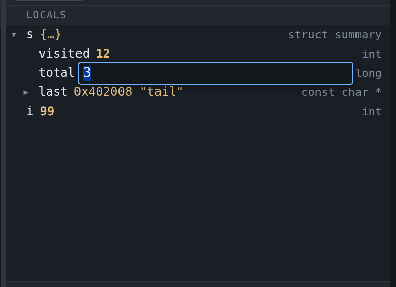

# Changing values

Double-click a value to edit it, and press Enter to write it through gdb. This
works in three places: the [Variables](variables.md) pane, the
[Registers](registers.md) pane, and the hex column of the
[memory viewer](memory.md).



Press Escape, or click elsewhere, to leave the value alone.

If gdb refuses what you typed, the box stays open with the text still in it and
turns red, and the reason appears in the status bar. Nothing has been written,
and the correction is made where the mistake was rather than retyped.

## What you can type

The box takes a gdb expression, not just a number. All of these are things you
can type into a variable's value:

```
42
0x2a
'A'
count + 1
&head
```

gdb evaluates the expression in the frame the row belongs to, so `count + 1`
means the `count` you are looking at.

The value shown afterwards is read back from the program, not echoed from what
you typed. Assigning `321` to a `char` shows `65 'A'`, because that is what
landed.

## Registers

Editing a register works the same way, and the same expressions apply — `$pc`
takes `main` or `0x401136` as readily as a number.

The value is read back in whatever format the pane is displaying, so typing
`42` into a register shown in hex gives `0x2a`.

Two kinds of register are not editable, and are not offered:

- **Vector and floating-point registers** that gdb prints as `{v4_float = {…}}`.
  That is several readings of the same bytes rather than one value, so there is
  nothing to type over.
- **Registers gdb has not named.** gdb's numbering has gaps; a write goes out as
  `$name = …` and there is no name to use.

## Memory

Each byte in the hex column is edited on its own, in hex, two digits. A `0x`
prefix is accepted, since that is how the addresses beside it are written.

Bytes shown as `??` are not editable: they were never read, so there is nothing
to change and nowhere to put it.

## What is not editable

Arrays, structs and unions are not. gdb refuses to assign to them, so the row
does not offer an edit rather than offering one that always fails. Scalars and
**pointers** are editable — redirecting a pointer is usually the most useful
thing to do in that tree.

Whether a row can be edited is gdb's answer, not a guess from the type name: the
row is marked when the pointer is over it, and left alone otherwise.

## Everything else sees the change

A write is announced to every connected browser, so a second tab showing the
same session re-reads what it is displaying rather than going stale. That
matters more than it sounds: assigning a local changes the register or the stack
slot behind it, and writing one byte can change a variable in the tree.

In the Variables and Registers panes the edited value is marked as changed until
the program next moves, the same way a value that changed at a stop is. The hex
view has no such mark: every byte there looks alike, and a highlight that
survived a scroll to another address would be worse than none.

## Worked example

```sh
mkdir -p /tmp/tour && cp testdata/fixtures/globals.c /tmp/tour/
gcc -g -O0 -no-pie -o /tmp/tour/globals /tmp/tour/globals.c
./gdb-wui -project /tmp/tour -exe globals
```

Break on line 65 and run. In the Variables pane, expand `s` and double-click
`visited`. Type `7` and press Enter. Then continue: the program prints
`visited=7`, because the value it goes on to use is the one you wrote.

## What editing does not do

- **It does not work while the program is running.** gdb resolves an expression
  in a frame, and a running program has none to resolve it in. Pause first.
- **It does not survive a re-run.** A write changes the process that is running
  now; starting again gets a fresh one.
- **It does not undo.** The previous value is not kept anywhere. Note it down
  before you overwrite something you may want back. (Renaming in the
  [Decompiled tab](decompilation.md#renaming-what-the-decompiler-guessed) does
  undo — that is an edit to a database rather than to a running process.)
- **It does not call functions.** `f(x)` would run `f` in the program, so the
  same rule the [hover evaluator](variables.md) uses applies here.
- **It does not edit the ASCII column** of the hex view, only the hex.
- **It cannot be started from the keyboard.** Opening the box needs a
  double-click; once it is open, Enter and Escape work. `set var` at the
  [console](console.md) is the keyboard route.
- **It does not write to memory the program has not mapped.** gdb refuses, and
  the box says so rather than reporting a write that did not happen.
