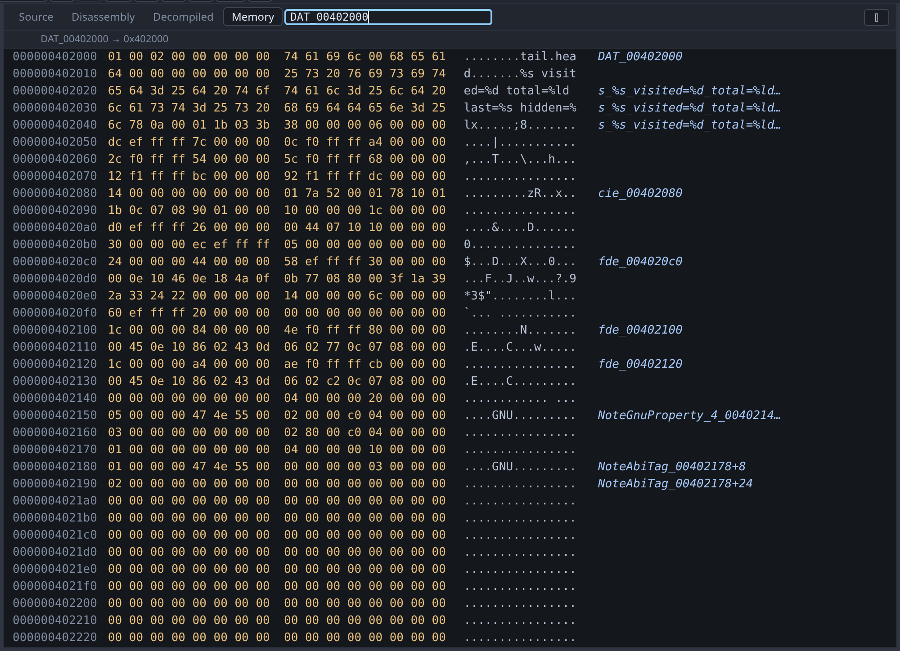

# Memory


The Memory tab shows sixteen bytes per row: the address, the bytes in hex, their
ASCII, and the symbol the row falls in.

The symbol column tells you what you are looking at, so a row reads as
`banner+16` rather than as an address you have to work out. Symbols are resolved
through gdb, so this works with whatever gdb knows — including the ELF symbol
table of a stripped binary, which needs no debug info.

Rows that belong to no symbol are left blank. Most of the stack and heap is
blank, which is accurate rather than missing.

## When only the decompiler has a name

Strip the symbol table and gdb has nothing to put in that column, on the program
whose hex you most need placing. With [the decompiler](decompilation.md)
configured, its labels fill it — `DAT_001a08de`, or whatever you renamed it to —
in the same italics the [call stack](../tour.md) uses, because Ghidra's label is
a guess and not something the binary says.



Everything about the rule is visible in that screenshot. `DAT_00402000` is
untyped and names its own row only. The format string a few rows down is typed,
so it goes on naming rows through its length. `NoteAbiTag_00402178+8` is eight
bytes into an object whose extent Ghidra knows, and the row below it is
twenty-four. And the rows in between are blank, because nothing is known about
them.

A label covers **as far as Ghidra knows it runs, and no further**:

| The label | The column shows |
|---|---|
| Typed — an array, a pointer, a struct | The name, then `name+16` through its length |
| Untyped | The name on its own row, and nothing after it |

That second row is the common case on a fresh import and it is a real limit, not
an oversight. Ghidra represents a byte nobody has looked at as one undefined
item however far the data actually runs: busybox's `applet_names` is a
1954-byte table that reads as a single byte until it is typed. Guessing the
extent from the next label along would name the padding between them, and a
column reading `DAT_00104010+2048` over a run of zeroes is worse than a blank
one.

The fix is the ordinary reverse-engineering gesture: right-click the name in the
[decompiled view](decompilation.md) and give it a type. `char[1954]` on that
table, and the column names every row of it from then on.

To change a byte, double-click it. See [changing values](editing.md).

## Entering an address

The go-to box at the right of the tab strip takes an expression, not only a
number: `&head`, `$sp`, `cfg->items` and `0x404040` all work, as does anything
else gdb can evaluate to an address. The slot header shows what your expression
resolved to, so a mistake is visible. `Ctrl+Shift+G` puts the cursor in the box.

The box acts on whichever view is focused, so it reads memory when the memory
view is the one you are looking at. See
[going somewhere](source.md#going-somewhere).

You can also reach the memory viewer without typing an address:
[hover a variable](variables.md), right-click it, and choose **Show where it is
stored** or **Show what it points to**. Double-clicking a data symbol in the
[Symbols pane](symbols.md) also opens it here.

## Unreadable bytes

Bytes in a page that is not mapped are shown as `??` rather than as zeros. Zeros
are a value and unmapped memory is not, so showing one as the other would be
misleading exactly when you are trying to find out whether a pointer is valid.

## Worked example

```sh
gcc -g -O0 -no-pie -o /tmp/tour/globals testdata/fixtures/globals.c
./gdb-wui -project /tmp/tour -exe globals
```

Break on line 49, run, open **Memory** and enter `&counter`. Everything the
program declares is in the next few rows, and you can read its data directly:

- `counter` is `07`.
- `banner` spells `gdb-wui` in the ASCII column.
- `hidden_total` is `9a 47 46 45 44 43 42 41`: the `0x4142434445464748` from the
  source, little-endian, with the low byte already changed because `main` has
  run its loop.
- `head` at `0x4040d0` holds `01`, then a pointer to `0x40200d`, which is the
  string `"head"`.

Now enter `$sp`. The same view appears with the symbol column empty all the way
down, because the stack belongs to no symbol.

## What the memory viewer does not do

- **It does not search** for a byte pattern.
- **It does not set watchpoints.** Use `watch` at the console.
- **It does not overlay structures.** It shows bytes; use the
  [Variables pane](variables.md) for a typed view of the same memory.
