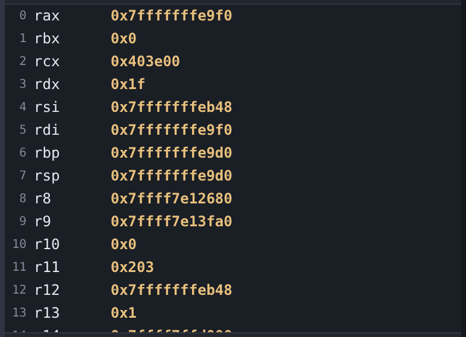

# Registers

The Registers tab lists whatever gdb reports for the target's architecture, in
gdb's order, read from the frame selected in the call stack. Registers that
changed at the last stop are marked, which makes single-stepping through a
prologue easier to follow.

The number beside each name is gdb's register number. It is the register's real
identity: gdb's list has gaps at stable indices, so a register with no name is
normal rather than a fault.

To see what a register points at, use it with [hover](variables.md) in the
[disassembly](disassembly.md): point at `%rax` to read it, or right-click it and
choose **Show what it points to** to open the [memory viewer](memory.md) at that
address.

## Worked example

Break anywhere, switch to the Registers tab, then step one instruction at a time
with `Alt+F11`. `rip` advances, and marks appear against whatever the
instruction touched.

On a foreign target debugged with a suitable gdb, the same pane shows that
architecture's registers, because the list comes from gdb rather than from
gdb-wui. See [remote targets](remote.md).

## What the Registers tab does not do

- **It does not write registers.** Use `set $rax = 1` at the
  [console](console.md); the pane will show the result.
- **It does not switch format per register.** Use `p/d $rax` at the console.
- **It does not group or filter.** The list is flat and complete, which on an
  architecture with several hundred registers is a long list.
