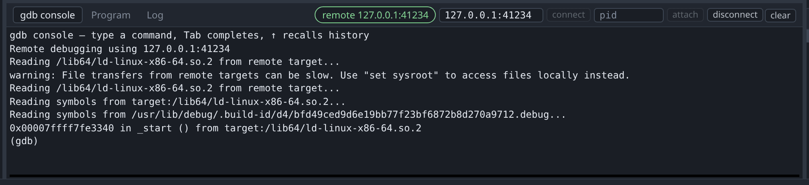
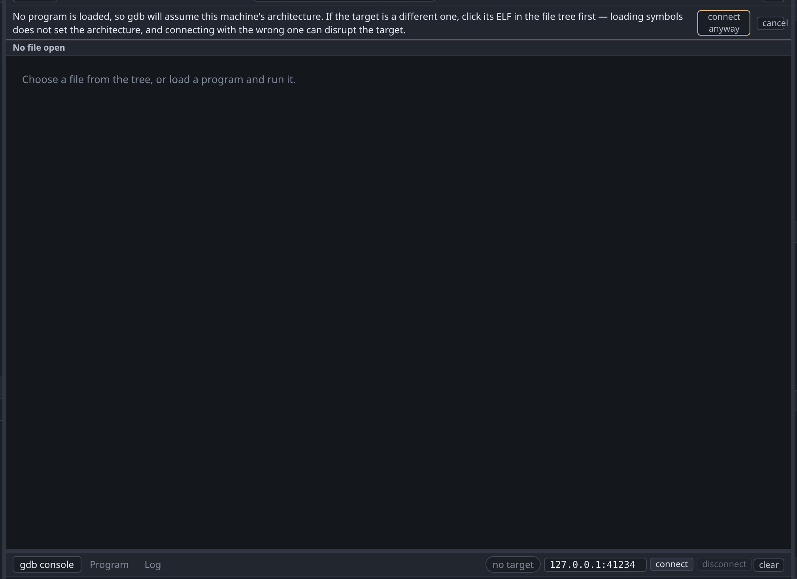
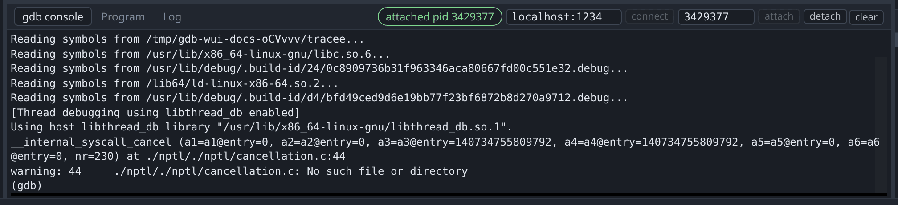

# Remote targets

gdb-wui can debug anything that speaks the GDB remote protocol: a gdbserver, an
emulator's stub, or a board on the end of a probe. It can also attach to a
process already running on this machine: a target it did not start and must not
kill.



The address box and the **connect** and **disconnect** buttons are in the
console's tab bar, with a pill showing whether gdb is attached, and a pid box
for [attaching to a local process](#attaching-to-a-local-process) beside them.
The buttons run `target remote <address>` and `disconnect`, so the console below
shows what ran, and shows gdb's own error text if the stub refuses.

Disconnecting uses `disconnect` rather than `detach`, because `detach` resumes
the target and someone inspecting a stopped machine usually does not want that.

## Load the program before connecting



Load the program first, then connect. gdb-wui asks for confirmation if you try
it the other way round.

`target remote` asks the stub for its registers immediately, and reading that
reply requires knowing the architecture. If gdb has the wrong architecture it
misparses the reply — a MIPS64 target read as x86-64 reports a meaningless
program counter, and can disturb the target enough to end the session.

Only loading the program sets the architecture, because only `file` reads it
from the ELF header. Measured against gdb 17.1 with a MIPS64 image: `file` gives
`mips:octeon/big`, while `symbol-file` and `add-symbol-file` both leave gdb at
the host's `i386`. Loading symbols is therefore not enough, even though the
[Symbols pane](symbols.md) fills with correct names.

## Debugging another architecture

To debug binaries for another architecture, install a suitable gdb (e.g.
`gdb-multiarch`) on your host machine, and use the `-gdb` argument when starting
gdb-wui to use it:

```sh
sudo apt install gdb-multiarch
./gdb-wui -project . -gdb gdb-multiarch -exe firmware
```

## Attaching to a local process



Put the pid in the narrow box beside the address one, and press **attach** or
Enter. It runs `attach <pid>`, so the console below shows the command and gdb's
answer to it, and typing that yourself does the same thing.

There is nothing to load first: gdb reads the program out of `/proc/<pid>/exe`,
symbols and architecture together, so the ordering care above applies to stubs
and not to this. The pill reads `attached pid 1234` and the button at the end of
the bar becomes **detach**.

Detaching leaves the process running, and so does shutting gdb-wui down — a
program that was somebody else's before the session stays theirs afterwards.
The kill button asks first, because killing one ends a program this session did
not start.

Two things an attached process does not bring with it:

- **No terminal.** It keeps the one it already had, so its output goes there
  and the terminal pane stays empty.
- **No decompilation**, until you click its ELF in the file tree. The decompiler
  works from a file you loaded, and attaching loads nothing.

On Linux, `attach` usually needs permission. The default
`kernel.yama.ptrace_scope` of 1 allows tracing only a descendant, so attaching
to an unrelated pid needs `sudo sysctl kernel.yama.ptrace_scope=0`, or a process
that has called `prctl(PR_SET_PTRACER, …)` for itself. Without it gdb answers
`ptrace: Operation not permitted.` in the console and nothing is attached.

### Try it

`tracee.c` is here to be attached to: it asks for any tracer with
`prctl(PR_SET_PTRACER, …)`, so this works without touching the sysctl above.

```sh
mkdir -p /tmp/tour && cp testdata/fixtures/tracee.c /tmp/tour/
gcc -g -O0 -no-pie -o /tmp/tour/tracee /tmp/tour/tracee.c
/tmp/tour/tracee & echo "pid $!"
./gdb-wui -project /tmp/tour
```

It prints `ready` once it can be attached to, and exits by itself after a
minute — start it again if you take longer.

Put the pid the shell printed into the box, press **attach**, and the pill turns
green. The program is stopped in whatever it was doing, which is `sleep`, so the
[call stack](threads.md) shows libc's `nanosleep` frames under `main`. Press
**continue**, then **pause**, and it stops somewhere else in the same loop.

`counter` is a global it increments every second, so the
[Variables pane](variables.md) has something to watch: add `counter`, continue,
pause again, and it has moved. Click `tracee` in the file tree first if you want
[decompilation](decompilation.md) as well — attaching loads no file of its own.

Press **detach** when you are done, and the process carries on without you.

## Worked example

A local gdbserver behaves the same way as anything remote, so it is a
convenient thing to try first:

```sh
mkdir -p /tmp/tour && cp testdata/fixtures/globals.c /tmp/tour/
gcc -g -O0 -no-pie -o /tmp/tour/globals /tmp/tour/globals.c
gdbserver 127.0.0.1:41234 /tmp/tour/globals &
./gdb-wui -project /tmp/tour
```

Click `globals` in the file tree to load it, enter `127.0.0.1:41234` in the
address box, and press **connect**. The pill changes to
`remote 127.0.0.1:41234`, and the console shows gdb's account of the attach.

To see the guard, try it in the wrong order: connect before loading anything and
gdb-wui shows the warning above instead of connecting with the wrong
architecture.

For qemu in user mode the shape is the same, and it is worth doing once on a
program you can rebuild, because it is where the architecture rule above stops
being theoretical:

```sh
sudo apt install gcc-arm-linux-gnueabihf qemu-user gdb-multiarch
mkdir -p /tmp/tour && cp testdata/fixtures/hello.c /tmp/tour/
arm-linux-gnueabihf-gcc -g -O0 -static -o /tmp/tour/hello-arm /tmp/tour/hello.c
qemu-arm -g 1234 /tmp/tour/hello-arm &
./gdb-wui -project /tmp/tour -gdb gdb-multiarch -exe hello-arm
```

Statically linked so that qemu needs no sysroot; `-L /path/to/sysroot` is the
alternative if you would rather link against the target's libraries. qemu waits
for a debugger before running anything, so nothing is missed by connecting late.

Connect to `localhost:1234` and the program stops at `_start`. Type
`show architecture` at the console and gdb answers `The target architecture is
set to "auto" (currently "armv7")` — read out of the ELF you loaded, not out of
qemu. Load nothing first and gdb reads the stub's registers as x86-64 instead,
which is the failure the warning above exists to prevent. The Registers pane is
another way to see it: `r0` and `cpsr` rather than `rax` and `eflags`.

The 64-bit recipe is the same with the names changed —
`sudo apt install gcc-aarch64-linux-gnu`, then `aarch64-linux-gnu-gcc` and
`qemu-aarch64` — and `show architecture` answers `aarch64` with `x0` and `sp` in
the Registers pane. Both are tested against a live qemu on every push.

Source debugging works from here like any other target: open `hello.c` in the
file tree, click line 14, and the breakpoint resolves to `main`. That is what
the `cp` in the first block is for — a binary records the path its compiler was
given, so one built straight out of `testdata/fixtures` leaves gdb with a file
name that is nowhere under `-project`. See
[No source file named …](../troubleshooting.md#no-source-file-named-tmptourhelloc).

## What remote targets do not do

- **gdb-wui does not launch anything.** It does not start gdbserver, run qemu or
  flash a board. Start the far end yourself, then connect to it.
- **It does not detect the target's architecture.** The architecture comes from
  the ELF you load, which is why the order matters.
- **It does not open core dumps.**
- **It does not list processes to pick from.** The attach box takes a pid you
  already have, from `pgrep`, `ps` or whatever started the thing.
- **`extended-remote`, `target sim` and similar are not on the buttons.** Type
  them at the [console](console.md); the pill follows, because it reflects gdb's
  state rather than which button was pressed.

{: .note }
> If the far end is **qiling**, a successful single-step is reported as
> `SIGTERM` on AArch64 and x86. This is a bug in qiling's stub rather than a
> problem with your program; see
> [Troubleshooting](../troubleshooting.md#program-received-signal-sigterm-on-every-single-step).
