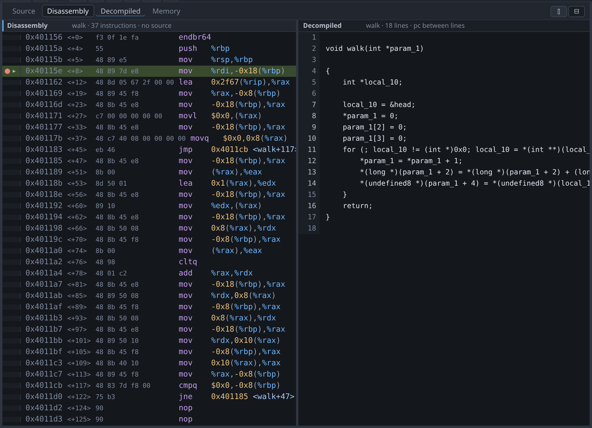
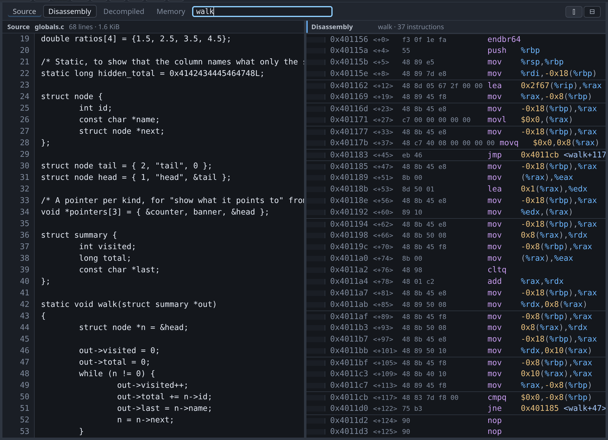

# Source and files

The file tree shows the directory given as `-project` and nothing outside it.
Paths are resolved against the project root and any path that escapes it is
refused. Executables are marked with an `ELF` badge.

To use an executable, right-click it. The three menu entries do three different
things:

| Menu entry | gdb command | What it does |
|---|---|---|
| **Load program** | `file` | Sets the program to run. This is the only one that sets the architecture. |
| **Replace symbols** | `symbol-file` | Replaces the symbols for the program already loaded. |
| **Add symbols…** | `add-symbol-file` | Adds more symbols, at an offset you supply. |

Left-clicking an ELF loads it as the program. If a program is already being
debugged, gdb-wui asks first, because loading a program replaces the inferior
and would otherwise discard a live session on a stray click.

{: .warning }
> Loading symbols does not set the architecture; only `file` does, by reading
> the ELF header. Measured against gdb 17.1 with a MIPS64 image: `file` sets the
> architecture to `mips:octeon/big`, while `symbol-file` and `add-symbol-file`
> both leave gdb at the host's `i386`. This is easy to miss, because the Symbols
> pane fills with correct names either way. See
> [remote targets](remote.md).

## The two line markers

The **green** bar is the program counter: where the program is now. The **blue**
bar is the line of an outer frame you have selected in the call stack.

They are kept separate so that selecting a caller does not move the
"executing here" marker onto code that is not executing. In the screenshot,
selecting frame `#1 main()` puts the blue bar on line 64 and leaves the green
bar on line 49.

Every value you read — the Variables pane, and [hover](variables.md) tooltips —
comes from the **selected** frame, so the markers also tell you which frame the
values belong to.

## Two views at once

To show two of the four centre views together, press the split button at the
right of the tab strip, or `F7`.

The second slot opens with the useful complement of what you were looking at:
the [decompiled C](decompilation.md) beside the
[disassembly](disassembly.md), which is the pairing this exists for, and the
disassembly beside anything else. Either slot can then be changed to any view
from the tab strip.

Drag the divider to resize. The split button toggles it off again; the button
beside it, or `Shift+F7`, stacks the two views instead of putting them side by
side. Both the arrangement and the divider position are remembered.

**One slot is focused, and the tabs and the keys act on it.** Click in a view to
focus it; the focused slot's header is marked, and its view is the one the tab
strip shows as active. This matters most for stepping: with the disassembly
focused, `F10` steps by instruction, and with the decompiled view focused it
[steps by decompiled line](decompilation.md#stepping-in-the-decompiled-view).
Both views follow the program counter either way.

## Going somewhere

The box at the right of the tab strip takes a place and sends the focused view
there. `Ctrl+Shift+G` puts the cursor in it.

It takes any of these:

| What you type | Example |
|---|---|
| A symbol | `walk`, `counter` |
| An address | `0x401136` |
| Any gdb expression | `&head`, `$pc`, `buf+16` |
| A file and a line | `globals.c:65` |
| A line in the file already open | `:65` |

**It acts on the focused view, and only that one.** In the screenshot the
disassembly is focused, so `walk` sent it to that function and left the source
pane beside it where it was. The same word typed with the source focused opens
`globals.c` at line 42 instead.

That is one target resolved once, by gdb, and then handed to whichever view
asked — which is what makes `walk` mean the same place in all four. gdb has to
be the one to answer, because the symbol table records link-time addresses and
every one of them is wrong once a position-independent executable is running.

A view that cannot show what you asked for says so and changes nothing rather
than switching to a view that can. An address in a stripped binary has no source
line; a variable has no instructions. What you typed stays in the box, so
clicking another view and pressing Enter again is the whole fix.

## When the source is not where gdb expects

A binary built on another machine records that machine's source paths. When gdb
names a file that is not present, gdb-wui shows a bar offering the files in your
project whose names match. Choosing one tells gdb about the substitution for
every file under that directory, not only the one you chose.

The offer follows the selected frame, because the file it is about does. A stack
routinely mixes all three cases — a frame whose source is here, one whose file
is on a machine you do not have, and one from a stripped binary with no file at
all — and clicking between them changes which, if any, there is anything to
offer.

## What the source view does not do

- **It does not edit.** There is no save.
- **It does not highlight syntax.** Each rendered line is a single text node,
  which is what lets the hover evaluator map a pixel position to a character
  without a reverse mapping. Adding highlighting would mean rebuilding that.
- **It does not serve files outside `-project`**, including through symlinks.
- **It refuses very large files** rather than rendering them slowly.
