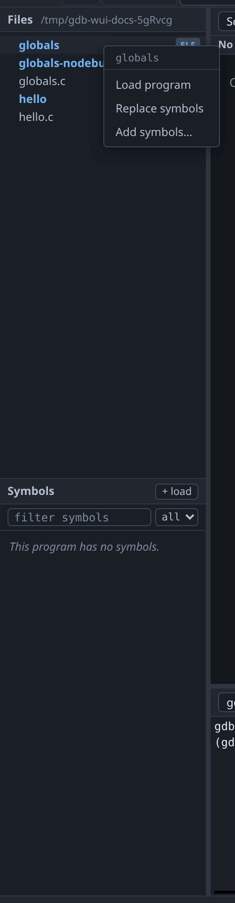
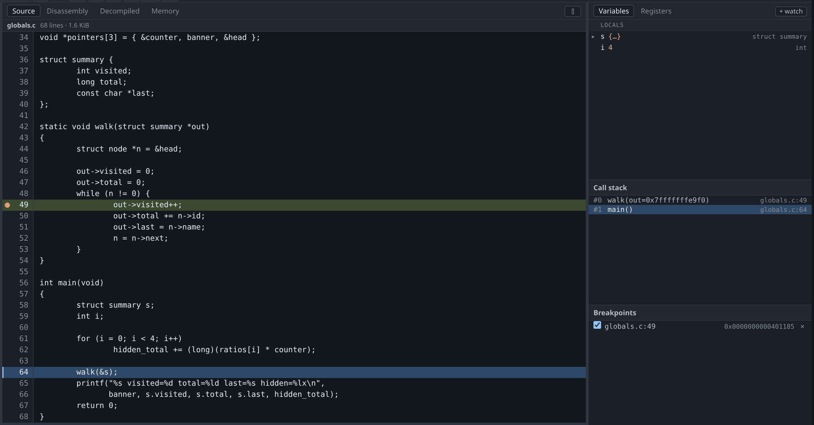

# Source and files

The file tree shows the directory given as `-project` and nothing outside it.
Paths are resolved against the project root and any path that escapes it is
refused. Executables are marked with an `ELF` badge.

To use an executable, right-click it. The three menu entries do three different
things:

| Menu entry | gdb command | What it does |
|---|---|---|
| **Load program** | `file` | Sets the program to run. This is the only one that sets the architecture. |
| **Replace symbols** | `symbol-file` | Replaces the symbols for the program already loaded. |
| **Add symbols…** | `add-symbol-file` | Adds more symbols, at an offset you supply. |

Left-clicking an ELF loads it as the program. If a program is already being
debugged, gdb-wui asks first, because loading a program replaces the inferior
and would otherwise discard a live session on a stray click.

{: .warning }
> Loading symbols does not set the architecture; only `file` does, by reading
> the ELF header. Measured against gdb 17.1 with a MIPS64 image: `file` sets the
> architecture to `mips:octeon/big`, while `symbol-file` and `add-symbol-file`
> both leave gdb at the host's `i386`. This is easy to miss, because the Symbols
> pane fills with correct names either way. See
> [remote targets](remote.md).

## The two line markers

The **green** bar is the program counter: where the program is now. The **blue**
bar is the line of an outer frame you have selected in the call stack.

They are kept separate so that selecting a caller does not move the
"executing here" marker onto code that is not executing. In the screenshot,
selecting frame `#1 main()` puts the blue bar on line 64 and leaves the green
bar on line 49.

Every value you read — the Variables pane, and [hover](variables.md) tooltips —
comes from the **selected** frame, so the markers also tell you which frame the
values belong to.

## When the source is not where gdb expects

A binary built on another machine records that machine's source paths. When gdb
names a file that is not present, gdb-wui shows a bar offering the files in your
project whose names match. Choosing one tells gdb about the substitution for
every file under that directory, not only the one you chose.

## What the source view does not do

- **It does not edit.** There is no save.
- **It does not highlight syntax.** Each rendered line is a single text node,
  which is what lets the hover evaluator map a pixel position to a character
  without a reverse mapping. Adding highlighting would mean rebuilding that.
- **It does not serve files outside `-project`**, including through symlinks.
- **It refuses very large files** rather than rendering them slowly.
