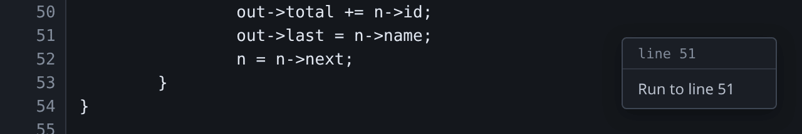
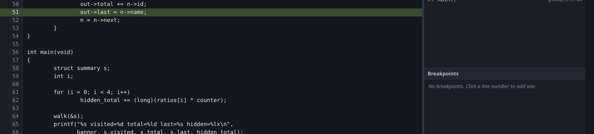

# Running and stepping

## Starting a program

| Button | Key | What it does |
|---|---|---|
| **Run** | `Ctrl+F5` | Runs to the first breakpoint. With no breakpoints set, the program runs to completion. |
| **Run→main** | `Ctrl+Shift+F5` | Runs and stops at `main`, whether or not a breakpoint is set there. |
| **Run→entry** | | Stops at the first instruction, before the C runtime has started. |

Use **Run→entry** for a stripped binary. There is no `main` to break on, and
often no symbol at all, so the entry point is the only address you know exists.
Once stopped there, the [disassembly](disassembly.md) and
[Symbols pane](symbols.md) have something to show.

## Moving through a program

| Button | Key | gdb command |
|---|---|---|
| ▶ | `F5` | `continue` |
| ⏸ | `F6` | interrupt |
| ⤼ | `F10` | `next` — step over a call |
| ↳ | `F11` | `step` — step into a call |
| ↰ | `Shift+F11` | `finish` — run to the end of this frame |
| ↓i | `Alt+F11` | `stepi` — one instruction |
| ⤼i | `Alt+F10` | `nexti` — one instruction, over a call |
| ■ | | `kill` |

Buttons disable themselves when gdb would refuse the command: nothing is
steppable while the program runs, and nothing is continuable before it starts.
If a button is grey, typing the equivalent command at the console would produce
an error.

## Running to a line

Right-click a line and choose **Run to** it. The program runs until it gets
there, and stops.



It works in all three code views. In the [source](source.md) and the
[decompiled C](decompilation.md) the entry names the line; in the
[disassembly](disassembly.md) it names the address, since that is what a row
there is. A decompiled line generated from no address — a brace, a declaration
— is nowhere to run to, and the menu offers nothing for it, the same lines the
gutter refuses a breakpoint on.

With the program not yet started, this starts it. That makes it a way to begin
a session at the line you care about rather than at `main`.



Underneath it is a temporary breakpoint and a resume, sent as one request.
gdb's own `until` and `advance` are not the same thing: both also stop when the
current frame returns, so running to a line in a function that has not been
called yet would stop somewhere else and report a stop. A breakpoint is reached
wherever it is, in whatever frame.

The breakpoint appears in the [Breakpoints pane](breakpoints.md) while it
lasts, and gdb deletes it when it is hit — the screenshot above is the pane
after arriving, with nothing in it. A run that never reaches the line leaves it
there, visible and deletable, rather than arming something invisible for the
next run.

## Stepping without a line table

To step in a binary with no debug info, open the
[Decompiled tab](decompilation.md) and step as usual, or press `Alt+F11` to
step one instruction at a time.

`F10` and `F11` need debug info: without it gdb's step range is the whole
function, so stepping over runs to the end of it. While the Decompiled tab is
showing, a step moves to the next decompiled line instead, using Ghidra's
address map in place of the missing line table.

## Worked example

```sh
mkdir -p /tmp/tour && cp testdata/fixtures/globals.c /tmp/tour/
gcc -g -O0 -no-pie -o /tmp/tour/globals /tmp/tour/globals.c
./gdb-wui -project /tmp/tour -exe globals
```

Set a breakpoint on line 64 (`walk(&s);`) and press Run. Press `F10` and you
land on line 65, having run all of `walk`. Restart and press `F11` instead, and
you land on line 44, inside `walk`. `Shift+F11` from there runs the rest of
`walk` and returns you to line 65.

Holding `F10` down walks the marker through the code. Steps do not queue: one
key repeat produces at most one step per completed stop, so releasing the key
leaves you where you can see rather than several stops further on.

## What running and stepping do not do

- **Reverse debugging** is not supported. There is no `reverse-step`, and no
  `rr` integration.
- **Non-stop mode** is not supported. All threads stop together and continue
  together; see [threads](threads.md).
- **Follow-fork and multiple inferiors** are not supported. gdb-wui debugs one
  program at a time.
- **Running until a condition** has no UI. Put a condition on a breakpoint at
  the [console](console.md) instead.
- **Run to has no keyboard shortcut.** It is a menu entry on the line the
  pointer is over, and there is no cursor in these views for a key to act on.
