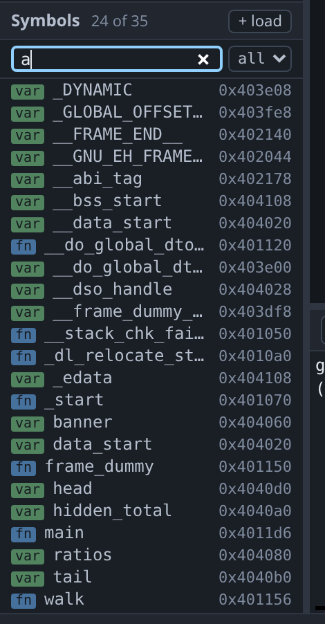
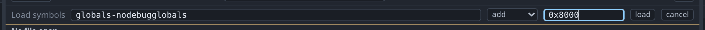

# Symbols



The Symbols pane lists every function and global in the loaded program, taken
from debug info if there is any and from the ELF symbol table if not. On a
release build that table is the only map available, and this pane is how you
read it.

The filter box matches substrings. The `fn` and `var` sigils show which kind
each symbol is, the `all` dropdown narrows the list to one kind, and dimmed rows
are symbols with no debug info, so you can see how much of the program has
usable type information.

Double-clicking a symbol jumps to it:

| Symbol | Goes to |
|---|---|
| A function with debug info | Its source line |
| A function with only an address | The [disassembly](disassembly.md) |
| A variable with only an address | The [memory viewer](memory.md) |

Right-clicking a symbol offers **Set breakpoint** and **Go to**.

## Loading more symbols

To load a symbol file for the program already running, click **+ load**.



Choose *replace* to run `symbol-file`, which replaces the symbols you have.
Choose *add* to run `add-symbol-file`, which reveals an **offset** field.

Use the offset when the image does not run where it was linked — a firmware blob
relocated by a bootloader, or a module mapped at a base chosen at load time.
Enter the difference between the two addresses and the symbols line up again. If
the offset is wrong, every symbol is wrong by the same amount, which shows up as
names appearing against the wrong code.

{: .warning }
> Loading symbols does not set the architecture; only loading the program does,
> because only `file` reads the ELF header. Loading symbols for the wrong
> architecture gives you correct-looking names over disassembly that is not
> meaningful. Load the program by clicking its ELF in the file tree first. See
> [remote targets](remote.md).

## Worked example

Build the same program with the debug info removed but the symbol table left
alone, which is what a release build looks like:

```sh
gcc -g -O0 -no-pie -o /tmp/tour/globals-nodebug testdata/fixtures/globals.c
objcopy --strip-debug /tmp/tour/globals-nodebug
./gdb-wui -project /tmp/tour -exe globals-nodebug
```

`walk`, `main`, `counter`, `banner`, `head` and `hidden_total` are all still
listed, and all dimmed, because gdb knows where each one is but not what type it
is. Right-click `walk` and set a breakpoint; it works as it would with debug
info.

The missing type information shows up when you read a value at the console:

```
(gdb) p counter
'counter' has unknown type; cast it to its declared type
(gdb) p (int)counter
$1 = 7
```

The [memory viewer](memory.md) needs no type at all, which makes it the easier
tool here, and its symbol column is populated from this same table.

## What the Symbols pane does not do

- **It lists functions and variables only.** Types, macros, files and gdb's
  other symbol domains are not shown; use `info types` at the
  [console](console.md).
- **It does not control demangling.** Names are as gdb reports them, so gdb's
  demangler settings apply.
- **It does not search by address.** Enter the address in the
  [memory viewer](memory.md) or the disassembly instead.
