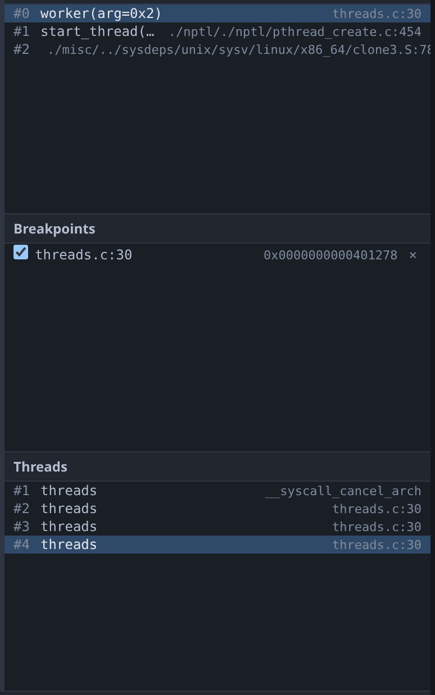

# Threads and the call stack



The Threads pane lists every thread gdb knows about and the frame each one is
in. Clicking a thread switches to it, and the call stack, Variables, Registers
and source markers all follow. The reply to a thread switch carries that
thread's stack, so no pane is left showing the previous thread's frames.

Clicking a **frame** selects it without moving the program counter. See
[source](source.md#the-two-line-markers) for what the two markers mean;
everything you read afterwards comes from the frame you selected.

## All-stop only

When one thread stops, all of them stop, and when you continue, all of them
continue. This is gdb's `all-stop` mode, and it is the only mode gdb-wui
supports. Non-stop mode, where some threads run while others are stopped, is a
gdb feature that this UI does not model.

## Worked example

```sh
gcc -g -O0 -no-pie -pthread -o /tmp/tour/threads testdata/fixtures/threads.c
./gdb-wui -project /tmp/tour -exe threads
```

Set a breakpoint on line 30, inside the worker loop, and press Run. The main
thread and three workers appear. Click between them: thread `#1` is in the
barrier or in `pthread_join`, the workers are in `worker`, and each shows its
own stack.

Press ⏸ instead of setting a breakpoint to interrupt the threads wherever they
happen to be, which for this program is usually inside libc's `nanosleep`. The
frame is still real, and the call stack shows how it was reached.

## What threads and the call stack do not do

- **Non-stop mode** is not supported, as above.
- **Per-thread breakpoints** have no UI. Use `break … thread N` at the
  [console](console.md).
- **Naming and filtering threads** is not supported. The list shows everything
  gdb reports.
- **Frame filters** and Python frame decorators are not supported.
