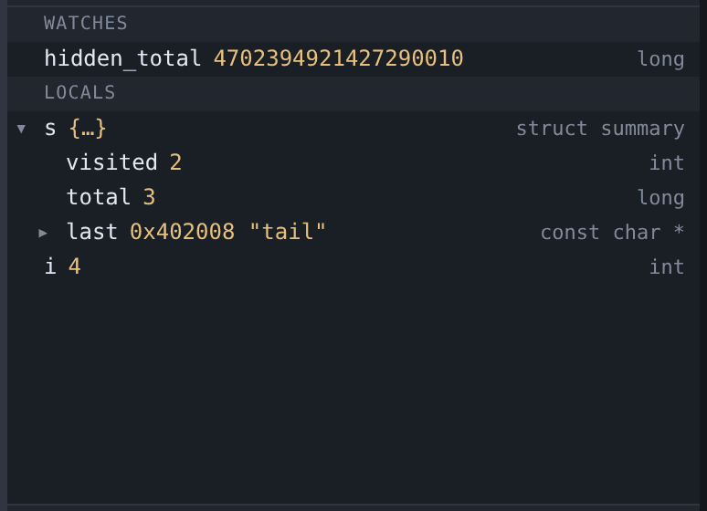
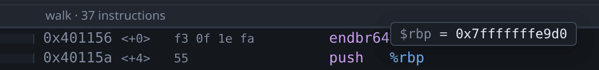

# Variables and hover



The Variables pane shows the locals and arguments of the selected frame, which
can be expanded to any depth. To add an expression that is re-read at every stop
and kept across stops, click **+ watch** and type it into the box that opens
over the pane's header. An expression gdb will not evaluate leaves the box open
with what you typed still in it.

Values that changed at the last stop are marked, so when stepping through a loop
you can see which field moved without comparing against memory yourself.

To change a value, double-click it. See [changing values](editing.md).

## Working with watches

A watch is the only thing in this pane you put there yourself, so it is the only
one you can take away. Every watch row carries a **×** at its right end; the
right-click menu offers the same thing in words.

| To do this | Do this |
|---|---|
| Add a watch | **+ watch** in the pane header |
| Remove one | The **×** on its row, or right-click → *Remove watch* |
| Read it as another type | Double-click its **type**, or right-click → *Cast to…* |

Casting is what makes a watch on a stripped binary useful. A global picked up
from the decompiled view arrives as something like
`*(undefined8 *)0x555555619250` — which is what is at that address, not what it
means. Type `char **` over the type cell and the row becomes
`(char **)(*(undefined8 *)0x555555619250)`, reading the same bytes as what they
actually are.

The expression is wrapped rather than replaced, so the address you found stays
exactly as you found it, and the cast stays visible in the row afterwards. The
watch also keeps its place in the list and anything you had expanded under it —
a watch you are correcting is the same watch. If gdb refuses the type, nothing
changes: the watch you had goes on working.

## Watching something from the decompiled view

Right-click a name in the [Decompiled tab](decompilation.md) and choose
**Watch**. This is the main way to keep an eye on a value in a binary with no
debug info, where there are no locals for the pane to list.

A global is the one to reach for. It lives at a fixed address, which is valid at
every program counter and needs no frame, so a watch on one keeps reading
correctly however far you step. A stack slot works too and floats with the
current frame. A register-backed variable is offered with a warning in the
tooltip, because the decompiler's expression for one is only valid near the
program counter it was recovered at — the register gets reused.

## Reading a value by hovering

To read a value, rest the pointer on it for 300 ms.


gdb-wui reads the whole expression, not the word under the pointer: hovering
`name` in `cfg.items[2].name` gives you that field rather than something else
called `name`. The evaluator walks `.`, `->` and `[…]` outwards from the
character you are on.

In the [disassembly](disassembly.md), hovering reads registers instead — `%rax`
on x86, or a bare `r0` or `sp` on other architectures — and the symbol in an
annotation such as `<add+4>`.



Integers are also shown in the other base, so that a value like
140737488347136 is shown as `0x7fffffffe000` as well.

Values are read from the frame selected in the call stack. The tooltip closes as
soon as the program moves, so it cannot show a value from the previous stop.

{: .warning }
> Only names, fields and subscripts are evaluated; `f(x)` is not. gdb would
> answer `f(x)` by calling `f` in the program being debugged, with whatever side
> effects that has, so the expression parser stops at a `(`.

## Showing where a value lives

To see the memory behind a value, right-click it.


The menu offers two things and names the address each would show:

- **Show where it is stored** — the address of the variable itself.
- **Show what it points to** — the address the variable holds.

A pointer has both, and they are different addresses. A plain `int` has only the
first. A variable held in a register has only the second, and the first entry is
omitted rather than shown with a wrong address.

This also works for registers, which is what makes them useful here: `%rbp`, or
a `char *` in `$x0`, leads directly to the bytes. Values below the first page
are not offered as pointers, because that page is never mapped.

## Worked example

```sh
gcc -g -O0 -no-pie -o /tmp/tour/globals testdata/fixtures/globals.c
./gdb-wui -project /tmp/tour -exe globals
```

Break on line 65 and run. Expand `s` in the Variables pane to see `visited 2`,
`total 3` and `last 0x402008 "tail"`. Add a watch on `hidden_total`, then step:
it is a global, so it stays readable in every frame.

Now hover `s.last` on line 66 to see the string, right-click it, and choose
**Show what it points to** to open the [memory viewer](memory.md) on the
characters themselves.

## What variables and hover do not do

- **They do not call functions**, as above.
- **They do not recover optimised-out values.** At `-O2` a local may not exist
  anywhere; the pane and the tooltip both show `<optimized out>` rather than a
  plausible wrong value.
- **They add no pretty-printers.** Values are formatted by gdb, so any gdb
  Python pretty-printers you have configured do apply.
