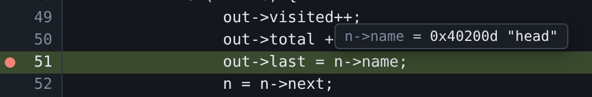
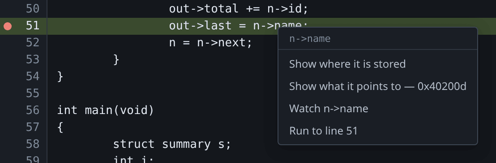
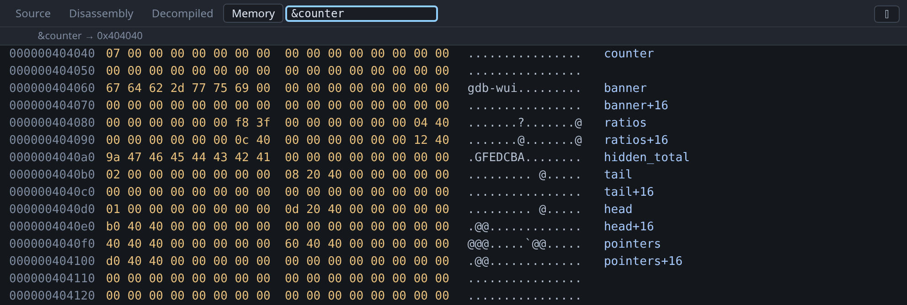

# A first session

This walks through loading a program, setting a breakpoint, inspecting a value
and finding it in memory. It takes about five minutes and uses a program in this
repository, which is also the program every screenshot on this site was taken
from.

## Build a program to debug

`testdata/fixtures/globals.c` is a small program with named globals: a counter,
a string, an array of doubles, a static, and a two-node linked list.

```sh
mkdir -p /tmp/tour && cp testdata/fixtures/globals.c /tmp/tour/
gcc -g -O0 -no-pie -o /tmp/tour/globals /tmp/tour/globals.c
```

The source is copied into `/tmp/tour` and compiled there, rather than compiled
where it sits, because a binary records the path its compiler was given. Build
it from `testdata/fixtures/globals.c` and that is the only name gdb has for the
file, which is not a path under `-project` — so the file tree has nothing to
click and a breakpoint on the file you can see is refused. Every example in this
documentation copies first for that reason; see
[No source file named …](troubleshooting.md#no-source-file-named-tmptourhelloc).

Build it with `-no-pie` so that the addresses shown below are the ones you will
see. A position-independent executable is relocated at load time, so its
addresses differ on every run. gdb-wui handles that, but it makes a tutorial
harder to follow.

## Start gdb-wui

```sh
go build ./cmd/gdb-wui
./gdb-wui -project /tmp/tour -exe globals
```

gdb-wui prints a URL on stdout and opens a browser at it. If no browser opens —
over SSH, in a container, or with no desktop session — copy the URL into a
browser yourself. This is a supported way to use gdb-wui, not a fallback.

The status bar at the bottom of the window should read **connected** and name
your gdb.

## Set a breakpoint and run

Click **globals.c** in the file tree, then click line number **49**, which is
`out->visited++;` inside `walk`. A red dot appears in the gutter, and the
breakpoint also appears in the **Breakpoints** pane on the right. These are two
views of the same breakpoint.


Press **Run** in the toolbar, or `Ctrl+F5`.

[](images/overview.png)

Every pane now has something in it:

- The green bar in the source view is the program counter, on line 49.
- **Locals** shows `out` and `n`: the parameter, and the cursor into the list.
- The **Call stack** has two frames, `walk` called from `main`. Clicking
  `#1 main()` moves a blue bar to the calling line and leaves the green bar
  where it is, so you can inspect a caller without losing sight of where the
  program stopped.
- The **gdb console** shows the stop as gdb reported it. It is a real gdb
  console, so you can type any gdb command into it.

## Read a value by hovering

Rest the pointer on `n->name` on line 51.



gdb-wui reads the whole expression, not the word under the pointer, so you get
the `name` field of the node `n` points at rather than something else called
`name`.

{: .note }
> Only names, fields and subscripts are evaluated. `f(x)` is not, because gdb
> would answer it by calling `f` in the program being debugged, which should not
> happen because a pointer moved across the screen.

## Follow the value into memory

Right-click the same expression.



The two memory entries are different things, and the menu names the address
each one would show:

- **Show where it is stored** — the address of the pointer variable itself.
- **Show what it points to** — the address it holds, `0x40200d` here.

The other two are about the line and the expression rather than the memory
behind them: **Watch** keeps the value in the Variables pane, and
**Run to line 51** runs the program to this line and stops.

Choose the second. The **Memory** tab opens at that address. Now type
`&counter` into the address box at the top and press Enter; the box takes an
expression, not only a number.



The right-hand column names the symbol each row falls in, so you see
`banner+16` rather than an address you have to work out. Rows that belong to no
symbol — padding here, and the stack and heap elsewhere — are left blank rather
than guessed at.

You can read the program's data straight off this view:

- `counter` is `07`.
- `banner` spells `gdb-wui` in the ASCII column.
- `hidden_total` is the `0x4142434445464748` from the source, stored
  little-endian, with `9a` in the low byte because `main` has already added to
  it.
- `head` at `0x4040d0` holds `01`, then a pointer to `0x40200d` — the string
  `"head"` you hovered a moment ago.

## Step

`F10` steps over, `F11` steps into, and `Shift+F11` runs to the end of the
current frame.

Hold `F10` down to walk the marker through the loop. The Locals pane and the
tooltip follow, and the tooltip closes as soon as the program moves, so it
cannot show you a value from the previous stop.

## Go somewhere else

Type `walk` into the box at the right of the tab strip and press Enter. The
source view opens at the function. `Ctrl+Shift+G` puts the cursor in that box,
and it also takes an address, a `globals.c:65`, or a bare `:65` for a line in
the file already open.

Now click the **Disassembly** tab and type `walk` again: the same word, and this
time you get its instructions. The box acts on whichever view you are looking
at. See [going somewhere](features/source.md#going-somewhere).

## Change a value

Double-click a value in the Locals pane, type a new one, and press Enter. It is
written through gdb, so the program goes on with what you typed. The same works
on a register and on a byte in the hex view.

To watch that change the program's output, the
[editing page](features/editing.md#worked-example) breaks on line 65 instead,
sets `s.visited` to 7, and the `printf` on that line prints `visited=7` rather
than the 2 it counted.

## Next

- Try the same program with the debug info removed, to see what the
  [Symbols pane](features/symbols.md) and the
  [Decompiled tab](features/decompilation.md) are for.
- Attach to a program that is already running: `testdata/fixtures/tracee.c` is
  there to be attached to, and
  [remote targets](features/remote.md#attaching-to-a-local-process) walks
  through it.
- Read [remote targets](features/remote.md) if the program you want to debug is
  not on this machine, or is for another architecture.
- Look up [the keyboard shortcuts](reference/keys.md).
