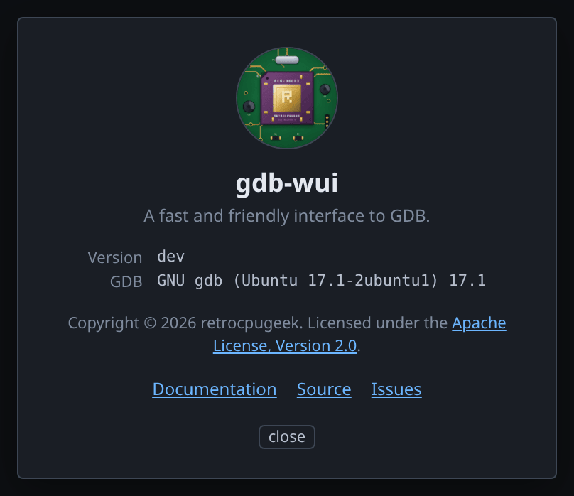

# Troubleshooting

Errors you may see, and what they mean. Most are gdb's or Ghidra's own messages,
passed through unchanged, so they sometimes need translating.

## Path element starting with '.' is not permitted

```
ghidra: Abort due to Headless analyzer error: Path element starting with '.' is not permitted
```

Ghidra rejects any path containing an element that begins with a dot, not only
the last one. `~/.cache/gdb-wui/ghidra` is rejected, and so is
`/home/you/.config/x/visible/ghidra`.

This rules out the conventional per-user cache locations, since
`$XDG_CACHE_HOME` is `~/.cache` and `$XDG_STATE_HOME` is `~/.local/state`, which
is why gdb-wui caches analysis in `<project>/gdb-wui-decomp` instead.

You will see this error if your project directory is itself under a dotted
directory, because then nothing inside it can hold the cache either. To fix it,
put the cache somewhere else:

```sh
./gdb-wui -project ~/.local/src/firmware -decomp-dir /var/tmp/gdb-wui-decomp
```

gdb-wui checks the path itself and falls back to a temporary directory rather
than failing, because Ghidra's own message names neither the path nor the
offending element, and only appears after a JVM has started.

## gdb does not know that architecture

A stock `gdb` supports only the architecture it was built for. Pointed at a MIPS
or AArch64 binary it will not disassemble, the registers will be wrong or
missing, and connecting to a stub produces errors that look like the stub's
fault.

To fix this, install a suitable gdb and select it with `-gdb`:

```sh
sudo apt install gdb-multiarch
./gdb-wui -project . -gdb gdb-multiarch -exe firmware
```

Note that loading the ELF is what sets the architecture. Loading only symbols,
with `symbol-file` or `add-symbol-file`, does not — which is why the Symbols
pane's **+ load** button says so, and why loading symbols against the wrong
architecture leaves you with correct-looking names over disassembly that is not
meaningful.

## 'counter' has unknown type; cast it to its declared type

gdb knows where the symbol is but not what type it is. This is normal for a
release build: no DWARF, but an intact ELF symbol table.

To read the value, cast it. Against `globals-nodebug`, which the
[Symbols page](features/symbols.md#worked-example) builds:

```
(gdb) p counter
'counter' has unknown type; cast it to its declared type
(gdb) p (int)counter
$1 = 7
(gdb) p (char *)&banner
$2 = 0x404060 <banner> "gdb-wui"
```

Take the *address* of anything that is not a scalar. `p (char *)banner` casts
the array's first eight bytes to a pointer and dereferences those, which gives
`Cannot access memory at address 0x6975772d626467` — the characters of
`gdb-wui` read as an address.

Hovering such a symbol shows its address rather than a value, for the same
reason. The [memory viewer](features/memory.md) needs no type at all and will
name the row for you.

## No function at 0x111b900

The address is not in the program the decompiler holds. In a running process
that usually means it is in a shared library, in the dynamic loader, or in an
emulator's own mapping rather than in your binary.

The message names the program Ghidra does hold, so you can see the mismatch. If
the address should be in your binary, the load bias is wrong: check that the
program shown in the Decompiled tab is the one you are running.

## Everything decompiles to FUN_00401136

Ghidra found no symbol table, so it named every function after its address. The
decompiled C is still correct — the recovered logic does not depend on names —
but nothing is named.

This is what a fully stripped binary looks like. To confirm:

```sh
readelf -S ./yourprogram | grep symtab   # no output means stripped
```

`nodebug` in `testdata/fixtures` is built this way on purpose, so it is
something to compare against: it is built by the
[disassembly page](features/disassembly.md#worked-example), and the same
command against `globals-nodebug` from the
[Symbols page](features/symbols.md#worked-example) prints a `.symtab` line.

If you have an unstripped copy or a separate symbol file, load it with the
Symbols pane's **+ load**, using *Add symbols…* with an offset if the image does
not run where it was linked.

## No source file named /tmp/tour/hello.c.

The path you asked for is not the path the binary records. A compiler writes
down the file exactly as it was given on the command line, together with the
directory it was run in, and gdb knows the file by those two and nothing else:

```sh
cd ~/src/gdb-wui
gcc -g -o /tmp/tour/hello testdata/fixtures/hello.c
readelf --debug-dump=info /tmp/tour/hello | grep -m2 -E 'DW_AT_(name|comp_dir)'
#    DW_AT_name     : testdata/fixtures/hello.c
#    DW_AT_comp_dir : /home/you/src/gdb-wui
```

So the program in `/tmp/tour` has no `hello.c` beside it, the file tree has
nothing to click, and a breakpoint asked for as `/tmp/tour/hello.c:14` is
refused — gdb has never heard that name. Meanwhile gdb-wui serves only what is
under `-project`, so even the copy gdb *can* find, back in the source tree, is
not one it may show you.

Two ways out:

- **Build from a copy inside the project**, which is what every example in this
  documentation does: `cp testdata/fixtures/hello.c /tmp/tour/` and then compile
  `/tmp/tour/hello.c`. The recorded path is then the one you are looking at.
- **Tell gdb where the source is**, if rebuilding is not an option. Put the file
  in the project and gdb-wui offers it in a bar when it stops in a frame whose
  file it cannot find; choosing it substitutes the whole directory. See
  [when the source is not where gdb expects](features/source.md#when-the-source-is-not-where-gdb-expects).

## globals.c is newer than the program — line numbers may be wrong

The source file on disk has changed since the binary was built, so the line
table points at lines that have moved. Rebuild the program.

This message is worth acting on rather than dismissing: it explains a breakpoint
that lands a couple of lines away from where you clicked.

## Program received signal SIGTERM, on every single step

If your target is [qiling](https://github.com/qilingframework/qiling), this is a
bug in its gdb stub rather than anything to do with your program. `handle_s`,
the handler for a hardware single-step, decides what to report from `emu_state`,
which is set to `STOPPED` after every `uc.emu_start()`. That means "not
currently inside emu_start" rather than "the program terminated", so the handler
reports `SIGTERM` for every successful step.

The step itself works; only the reply is wrong.

You will see this on **AArch64 and x86** but not on **MIPS**, and the difference
is in gdb rather than in the emulator. MIPS has no hardware single-step, so gdb
emulates one: it works out the address of the next instruction, sets a
breakpoint there, and sends `vCont;c`. That goes through the stub's continue
handler, which classifies the stop correctly. On AArch64, gdb sends `vCont;s`
and reaches the broken handler.

## The login link expired

The login link is single-use and lasts 60 seconds. To get another without losing
your gdb session or breakpoints:

```sh
./gdb-wui -print-url
```

## The Decompiled tab says "Ghidra is starting"

Import and analysis take seconds for a small program and minutes for firmware.
The **Log** tab shows Ghidra's progress line by line, which is why that log is
not behind a flag: without it, a slow start looks the same as a stuck one.

If it never finishes, the log will say why in Ghidra's own words.

## The call stack is all `?? ()`

gdb has no symbol for the functions of a stripped binary, so it says so. To get
names, run gdb-wui with `-ghidra`: the decompiler knows what is there, and the
frames are named once it has analysed the binary. See
[naming the call stack](features/decompilation.md#naming-the-call-stack).

Those names are the decompiler's, not symbols, and are shown in italics to say
so. Frames in libc keep gdb's own names. Right-clicking one offers to
[rename it](features/decompilation.md#renaming-variables-and-functions).

## Hovering a decompiled local shows nothing

Three different reasons, and the pane distinguishes them.

A decompiler temporary — `iVar1`, `uVar2` — exists nowhere in the machine, so
there is nothing to read. A variable the decompiler put in a register is only
that register near one program counter, and away from it the row is blank
rather than wrong.

The third is the architecture. Turning Ghidra's stack offsets into an address
needs the frame base, which is recovered differently on every ABI and is
established by measurement: x86, ARM, AArch64, PowerPC and MIPS have one — both
widths of each — and on anything else stack locals show nothing at all. A guess there would read as a
value from the neighbouring slot. See
[stack offsets](https://github.com/retrocpugeek/gdb-wui/blob/master/docs/decompilation.md#stack-offsets).

## Rename is greyed out in the Decompiled tab

You started gdb-wui with `-ghidra-project`, so the decompilation is coming from
a project of yours. That one holds your own names, types and comments, and
gdb-wui only ever reads it — the menu items stay visible and say so on hover
rather than disappearing. Commenting is greyed out for the same reason and can
be read the same way.

Drop `-ghidra-project` and pass `-ghidra` alone to work in the project gdb-wui
imports for itself, which it may write to. Names made there are keyed on the
binary's SHA-256 and are not visible in your own Ghidra project.

## My renamed functions are back to FUN_00401136

The analysis is keyed on the binary's SHA-256, so a rebuild gets a fresh project
with none of the names. That is deliberate: reading one build's names against
another build's addresses is a confidently wrong answer.

Nothing is lost — the old project is still on disk under the cache root, keyed
by the old hash — but there is no way to carry names across a rebuild. Name a
binary you intend to keep.

## Which version am I running?

Click **?** in the toolbar.



The box reports the gdb-wui build and the gdb behind it. Both are worth quoting
in a bug report, because most of what gdb-wui shows comes from gdb and its
answers differ between versions.

The version comes from the server rather than the page, so a browser tab left
open across a restart reports the server it is actually talking to.
